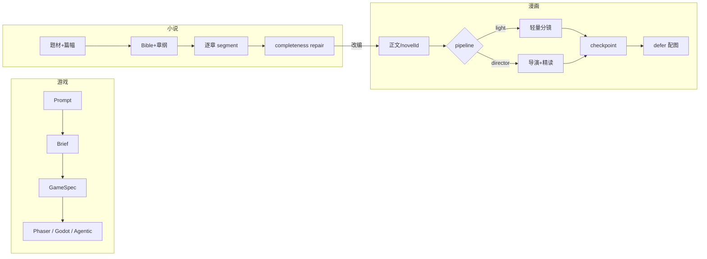
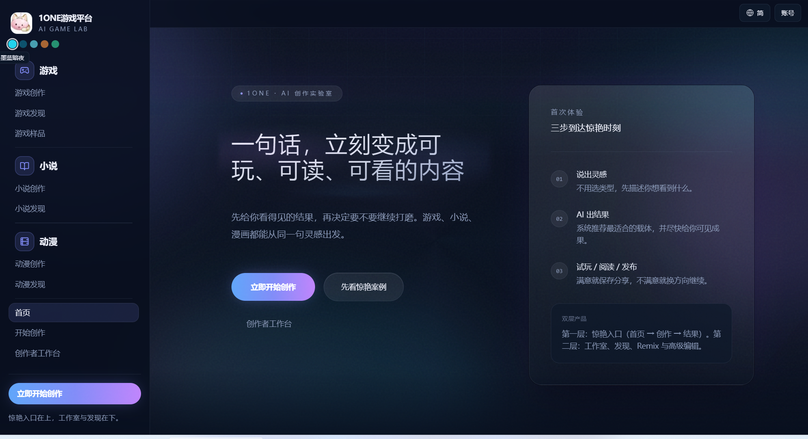
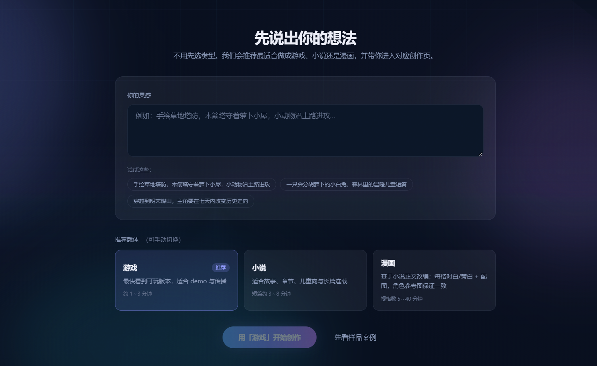
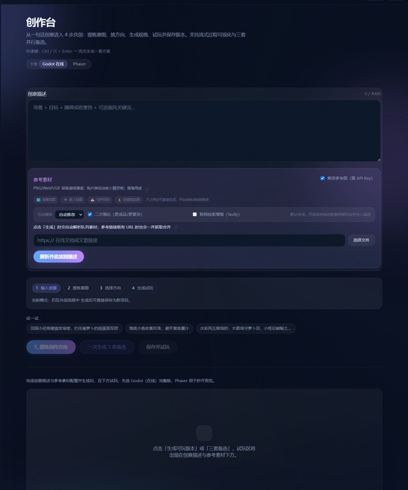
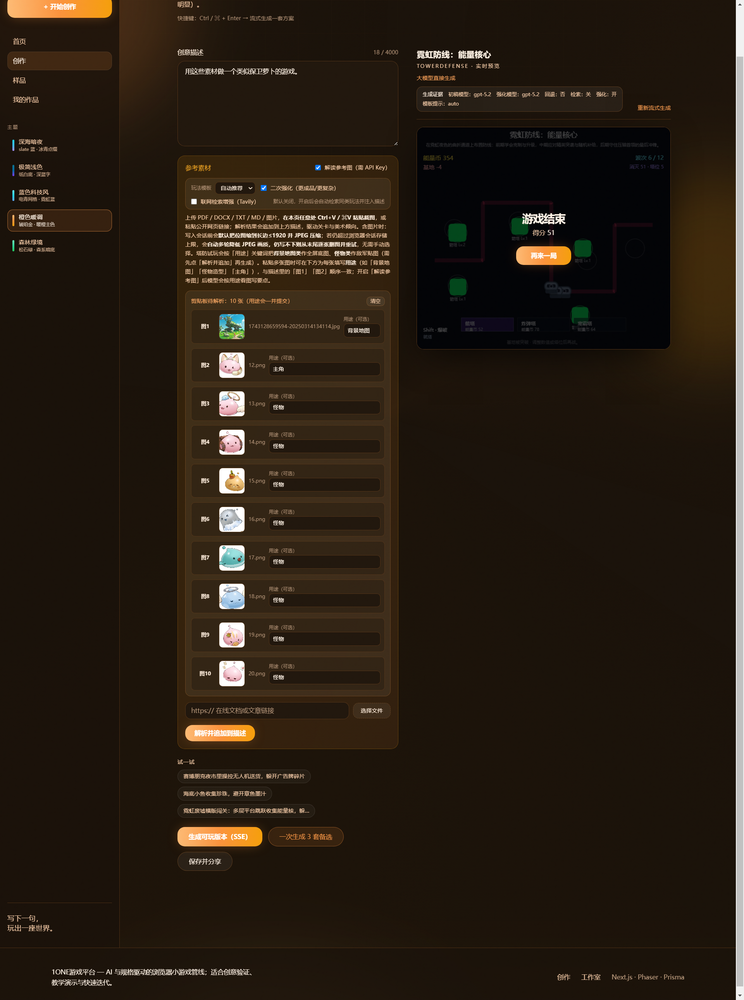
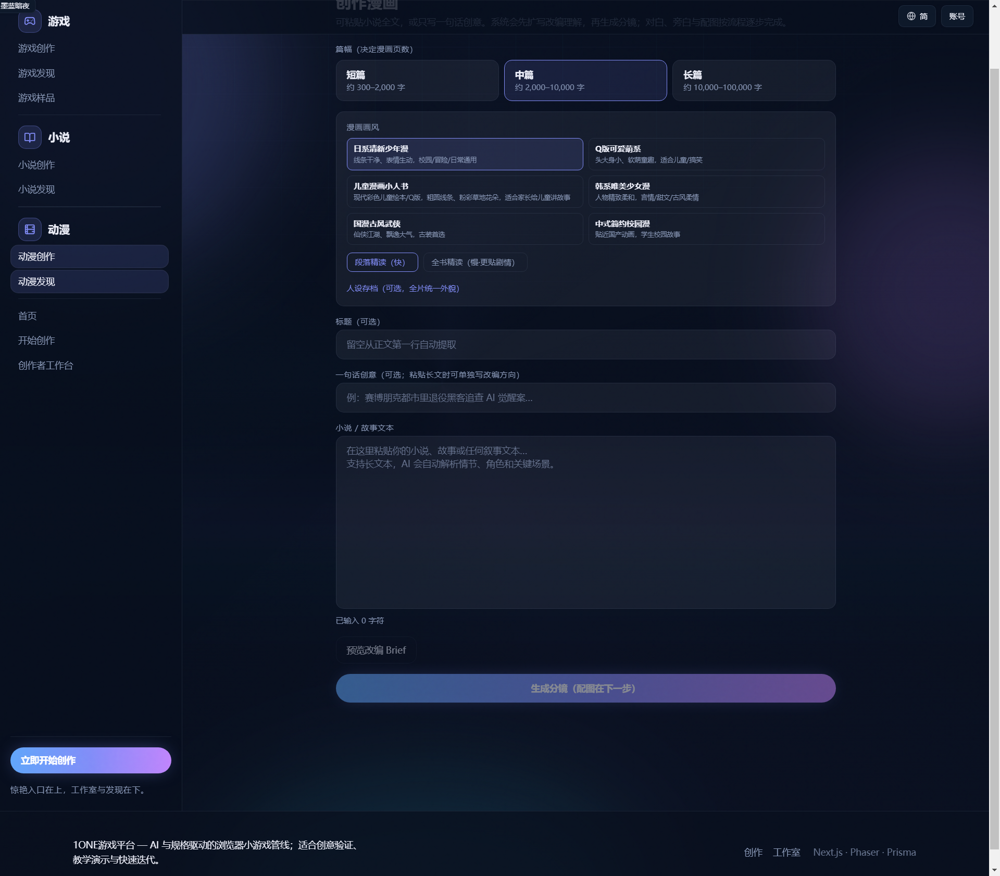
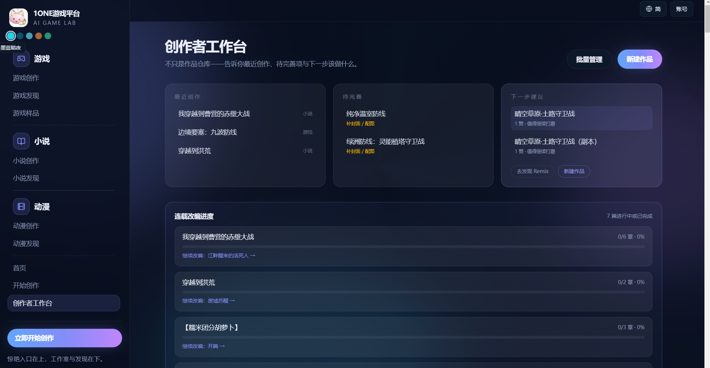
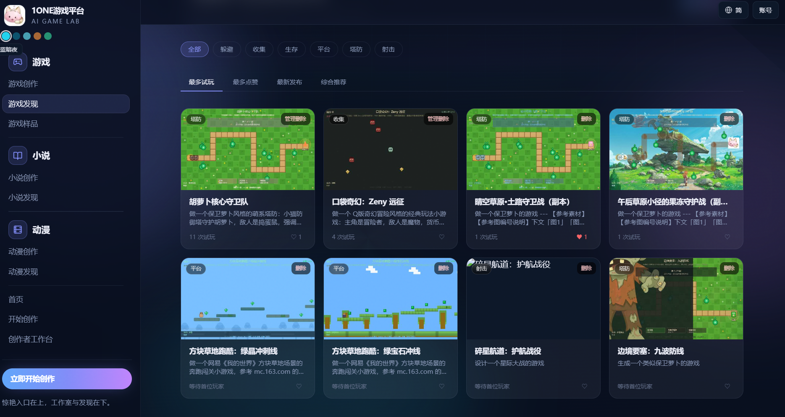
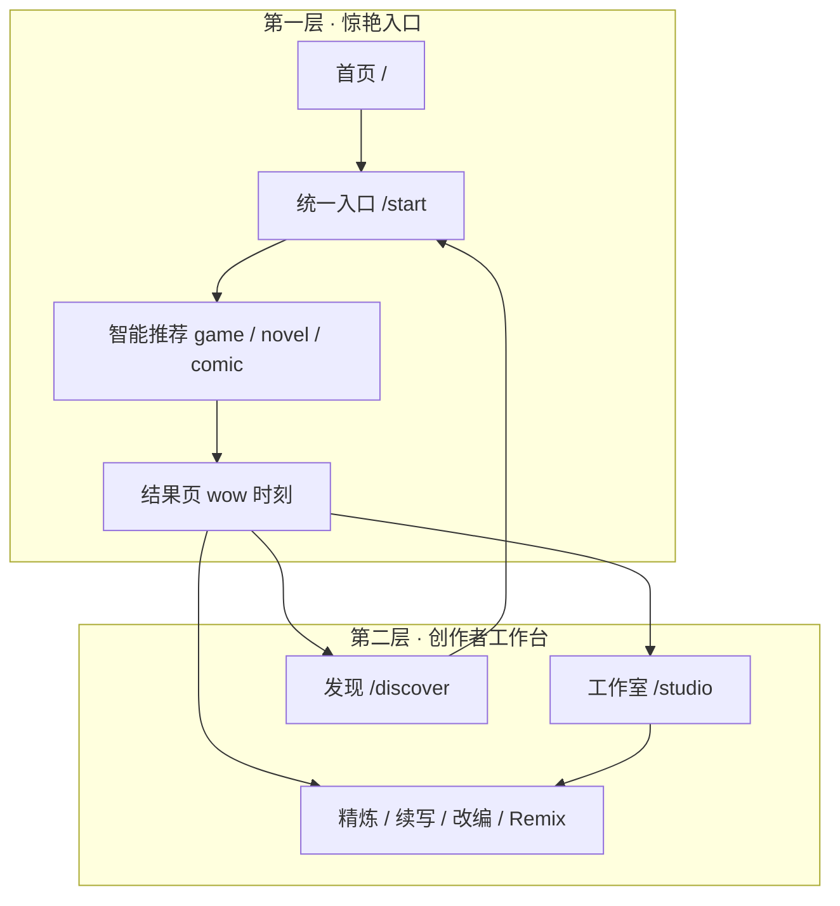
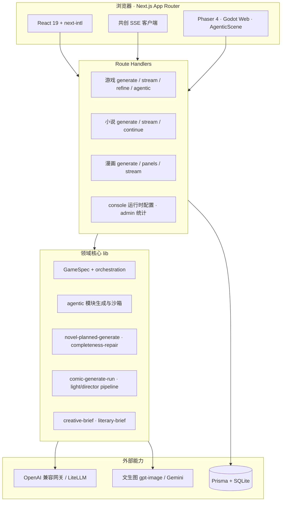

<div align="center">


# Operone 创作平台

**一句话 → 可玩游戏 · 可读小说 · 可看漫画**

AI 与规格驱动的一体化创作实验室：从灵感输入到试玩/阅读/分镜配图，再到工作室管理与社区发现，全链路可在浏览器内完成。

[](https://nextjs.org/)
[](https://react.dev/)
[](https://www.prisma.io/)
[](https://phaser.io/)
[](https://godotengine.org/)

[快速开始](#快速开始) · [近期重大更新](#近期重大更新-2026-06) · [三大创作链路](#三大创作链路) · [English](#english-overview)

</div>

---

## 目录

- [我们是谁](#我们是谁)
- [近期重大更新（2026-06）](#近期重大更新-2026-06)
- [三大创作链路](#三大创作链路)
- [平台能力一览](#平台能力一览)
- [产品截图](#产品截图)
- [双层产品结构](#双层产品结构)
- [架构概览](#架构概览)
- [多语言与国际化](#多语言与国际化)
- [功能与路由](#功能与路由)
- [技术栈](#技术栈)
- [快速开始](#快速开始)
- [模型与配置](#模型与配置)
- [环境变量](#环境变量)
- [开发与 QA](#开发与-qa)
- [项目结构](#项目结构)
- [相关文档](#相关文档)
- [English — Overview](#english-overview)

---

## 我们是谁

**Operone 创作平台**（AI GAME LAB）不是单一的「小游戏生成器」，而是一套 **游戏 + 小说 + 漫画** 共用的 AI 创作基础设施：

| 维度 | 说明 |
|------|------|
| **面向谁** | 想快速验证创意的个人创作者、教学演示、独立开发试玩、UGC 社区 |
| **交付什么** | 结构化 **GameSpec** 即时试玩、分章节小说正文、分镜 + 配图漫画 |
| **怎么做到** | LLM 编排 + 规格校验修复 + 流式 SSE + 参考图/联网增强 + 多引擎运行时 |
| **体验原则** | **先给惊艳结果，再深度打磨** — 入口极简，工作室承接进阶 |

三条产品线共享：账号体系、发现广场、工作室、五语系 i18n、运行时配置后台，但各自有独立的生成管线与 QA 回归。

---

## 近期重大更新（2026-06）

### 游戏 · Agentic + 双引擎 + 编排

| 改动 | 说明 |
|------|------|
| **Agentic 游戏模块** | LLM 输出可运行 JS 模块，经沙箱校验后挂载到 Phaser `AgenticScene`；template-first 与样品 Scene 对齐 |
| **封面↔试玩一致** | V2 资产 manifest + 预加载；`qa:cover-play-alignment` 验收封面与 canvas 资产距离 |
| **编排 Phase 0～4** | ContextPack、lint/repair 多轮、Comfy 探活并行、RunTrace 可观测 |
| **Godot 11 模板矩阵** | 塔防/平台/射击等 Web 导出 + 3D SubViewport；`qa:godot-export:matrix` |
| **平台运行时配置** | super_admin 在 `/console` 轮换网关/模型/SMTP，DB 覆盖 `.env` |
| **邮箱注册登录** | 验证码 + OAuth 占位；运营后台配置 Resend/SMTP |

### 小说 · Planned Pipeline 根因修复

| 改动 | 说明 |
|------|------|
| **逐章 segment 写作** | 短/中篇：`Bible → 章提纲 → 逐章 segment → fill`，不再「一次写完 + 外层 repair」 |
| **章节标记归一化** | `normalizeSegmentToChapterPlan` 修复无 `=== 第N章 ===` 时合并丢章 |
| **内置完整性 repair** | `novel-completeness-repair` 在 pipeline 内闭环，缺章/缺结局多轮补全 |
| **四档篇幅** | short / medium / long / children，各自字数与章数校验 |
| **文学 Brief 独立** | 与游戏 Brief 分离，禁止 templateId/玩家单位等游戏术语渗入小说 |

### 漫画 · Pipeline 选型 + 轻量分镜性能

| 改动 | 说明 |
|------|------|
| **Pipeline 选型修正** | 短篇/儿童一律轻量；中篇默认 8 页走轻量，≥12 页才 `long_director` |
| **人设图 defer** | 分镜先入库，Character Sheet 延至配图阶段，避免分镜阶段假死 |
| **跳过重复 Brief** | `from_novel` 有 `novelId` 时跳过漫画 Brief 二次扩写 |
| **轻量分镜优化** | 中篇默认四宫格 + 2 页/批 + 批失败二分降级（替代逐页 180s×N） |
| **Checkpoint 兼容** | layout/pipeline 不匹配的 draft 自动忽略，避免错批 resume |
| **验证** | 宋辽 E2E：中篇 8 页 ~314s，`pipeline=light`（修复前 600s 超时） |

一键历史问题总验：`npm run qa:historical-closure` · 文学链路：`npm run qa:songliao-literary-regression`

---

## 三大创作链路

### 游戏 — 4 步共创 · Phaser 秒开 · Godot 完整导出

```
灵感 + 参考图/联网 → Creative Brief（八维扩写）
  → GameSpec 草稿 → lint / repair → enrich
  → Phaser 预览 | Godot Web 导出 | Agentic 模块
  → 保存 Project → refine / patch → 自动封面
```

- **创作台**（`/create`）：4000 字描述、参考图用途标注、Tavily 联网、并行 3 套备选
- **Agentic 路径**：`generate-game-module.ts` → 沙箱 → `AgenticScene`；E2E 可 stub，真实 LLM 走 `qa:generate-stream-agentic`
- **双引擎**：Phaser 4 浏览器即时预览；Godot 4.4 母版 `ai-mother-universal` 导出 Web
- **关键文件**：`src/lib/generate-spec.ts` · `src/lib/agentic/` · `src/game/engine/` · `godot-templates/`

### 小说 — Bible → 章纲 → 逐章写作 → 完整性闭环

```
书名 + 题材 + 篇幅 → 文学 Brief 扩写
  → [planned] Bible → 章提纲 → 逐章 segment 流式写作
  → completeness 校验 → 内置 repair（缺章/缺结局）
  → 封面 / TTS 听书 → 长篇 segment 续写
```

| 篇幅 | 典型规模 | 管线要点 |
|------|----------|----------|
| **短篇** | ~2k 字 · 3 章 | 逐章 segment + repair |
| **中篇** | ~1.3 万字 · 5 章 | 同上，章纲驱动 |
| **长篇** | ~6 万字 · 17 章+ | outline 锁定 + 分段续写 + polish |
| **儿童** | ~500 字 · 1 章 | 温暖语言 + 后置校验 |

- **关键文件**：`src/lib/novel-planned-generate.ts` · `novel-long-generate.ts` · `novel-completeness-repair.ts` · `novel-chapters.ts`
- **QA**：`npm run qa:songliao-literary-regression`（宋辽四档 + 漫画改编）

### 漫画 — 轻量/导演双流水线 · 分镜 checkpoint · 延迟配图

```
正文或 novelId → [可选] 角色 roster
  → pipeline 选型（light | long_director）
  → 分镜 JSON（分批 + checkpoint）
  → [defer] Character Sheet → panel 文生图
  → 封面后台生成 → 发现页展示
```

| Pipeline | 适用 | 特点 |
|----------|------|------|
| **light** | 短篇/儿童/中篇默认页数 | 2 页/批、四宫格（中篇）、二分降级、无导演包 |
| **long_director** | 长篇或 ≥12 页（中篇） | 导演包 + 精读 + 蓝图 + 分块分镜 |

- **from_novel**：跳过 Brief 扩写；人设图在配图阶段按需生成
- **关键文件**：`src/lib/comic-generate-run.ts` · `comic-pipeline.ts` · `comic-generate-config.ts` · `product-config.ts`
- **QA**：`npm run qa:comic-director-pipeline` · `npm run qa:comic-storyboard-resilience`



---

## 平台能力一览

<table>
<tr>
<td width="50%" valign="top">

**三模态一体**  
同一句灵感可走向游戏、小说或漫画；小说可一键改编为漫画，工作室追踪连载改编进度。

</td>
<td width="50%" valign="top">

**4 步共创式游戏**  
输入创意 → 提炼意图 → 挑选方向 → 生成可玩版本；支持 SSE 流式、并行 3 套备选、Agentic 模块。

</td>
</tr>
<tr>
<td width="50%" valign="top">

**双轨游戏运行时**  
**Phaser** 秒级预览 + **Godot Web** 完整导出；11 类玩法模板 + 程序化视觉升级。

</td>
<td width="50%" valign="top">

**小说 planned pipeline**  
Bible → 章纲 → **逐章 segment** → **内置 completeness repair**（结局、章数、字数）。

</td>
</tr>
<tr>
<td width="50%" valign="top">

**漫画智能 pipeline**  
轻量/导演自动选型；Character Sheet defer；2 页/批 + 四宫格 + 二分降级；checkpoint 断点续跑。

</td>
<td width="50%" valign="top">

**参考素材 ingest**  
文档/图片/URL 解析合并进 Prompt；塔防等模板按用途自动贴图。

</td>
</tr>
<tr>
<td width="50%" valign="top">

**五语系 i18n**  
`zh-Hans` / `zh-Hant` / `en` / `ms` / `th` — 路由、UI、API 进度与错误消息按 locale 返回。

</td>
<td width="50%" valign="top">

**UGC 与 Remix**  
发现广场多维度排序、点赞/试玩统计、样品馆横滑画廊、短链分享 `/s/[code]`。

</td>
</tr>
<tr>
<td width="50%" valign="top">

**运营后台**  
super_admin：`/console` 网关/模型/SMTP 运行时配置；`/admin` 作品与统计。

</td>
<td width="50%" valign="top">

**产品参数代码化**  
模型、超时、篇幅、pipeline 阈值集中在 `src/lib/product-config.ts`，部署只需密钥与网关。

</td>
</tr>
<tr>
<td colspan="2" valign="top">

**自动化 QA** — 历史问题总验、宋辽文学 E2E、多语回归、Godot 导出矩阵、Playwright CI、产品线分验（`qa:product-lines`）

</td>
</tr>
</table>

---

## 产品截图

> 以下均为仓库内真实界面截图（`src/png/`），可直接在 GitHub 预览。

### 首页 — 惊艳入口

<p align="center">
  
</p>

**首页**聚焦「一句话，立刻变成可玩、可读、可看的内容」。左侧导航按 **游戏 / 小说 / 动漫** 组织创作与发现；右侧 **三步到达惊艳时刻**：说出灵感 → AI 出结果 → 试玩/阅读/发布。

---

### 统一创作入口 — 智能推荐载体

<p align="center">
  
</p>

**`/start` 统一入口**：用户无需先选类型，系统根据灵感推荐 **游戏 / 小说 / 漫画** 最优载体（可手动切换）。

---

### 游戏创作台 — 4 步共创 + 双引擎

<p align="center">
  
  
</p>

**游戏创作台**（`/create`）：Godot 在线 / Phaser 双引擎、参考图、联网检索、4 步进度条与并行备选。

---

### AI 小说创作 — 类型 × 篇幅 × 流式写作

<p align="center">
  
</p>

**小说创作**（`/novel/create`）：11 种题材 + 短篇/中篇/长篇/儿童四档；文学 Brief 扩写 → 流式逐章写作 → 完整性校验。

---

### AI 漫画创作 — 画风 × 精读模式 × 人设一致

<p align="center">
  
</p>

**漫画创作**（`/comic/create`）：6 种画风、段落/全书精读、人设存档；轻量 pipeline 默认先分镜入库，配图异步补全。

---

### 创作者工作台 · 发现广场 · 样品馆

<p align="center">
  
  
</p>

**`/studio`** 追踪待完善项与小说→漫画改编进度；**发现页** 支持 Remix；**`/samples`** 样品馆试玩 + 克隆。

---

## 双层产品结构



| 层级 | 目标 | 代表页面 |
|------|------|----------|
| **第一层** | 30 秒内看到成果 | `/` · `/start` · `/play` · `/novel/[id]` · `/comic/[id]` |
| **第二层** | 长期创作与运营 | `/studio` · `/discover` · `/console` · `/admin` |

---

## 架构概览



### 数据模型（节选）

| 模型 | 用途 |
|------|------|
| `Project` | 游戏 specJson、封面、试玩/点赞、Agentic 模块 |
| `Novel` | 正文、篇幅档、summary、characterRosterJson |
| `Comic` | 分镜 JSON、配图 URL、关联 novelId、draft checkpoint |
| `PlatformRuntimeConfig` | 网关/模型/SMTP 加密配置（DB 覆盖 .env） |
| `User` | 邮箱/OAuth、角色、额度 |

Schema：`prisma/schema.prisma` · 迁移：`prisma/migrations/`。

---

## 多语言与国际化

| Locale | 语言 |
|--------|------|
| `zh-Hans` | 简体中文（默认） |
| `zh-Hant` | 繁体中文 |
| `en` | English |
| `ms` | Bahasa Melayu |
| `th` | ไทย |

- **路由**：`/[locale]/...` · 消息：`src/messages/*.json`
- **API 进度**：`progressNovelMessage` / `progressComicMessage` 按 locale 返回
- **QA**：`npm run qa:multilingual-locale` · `npm run qa:novel-locale`

---

## 功能与路由

| 路径 | 说明 |
|------|------|
| `/` · `/start` | 首页 · 统一创作入口 |
| `/create` | 游戏 4 步共创台 |
| `/novel/create` | 小说四步流（Brief → 写作） |
| `/comic/create` | 漫画分镜与风格配置 |
| `/studio` | 创作者工作台 + 改编进度 |
| `/discover` · `/games` · `/novels` · `/comics` | 发现与列表 |
| `/play/[id]` | 游戏试玩 + refine |
| `/novel/[id]` | 阅读器 + 听书 + 改编漫画 |
| `/comic/[id]` | 分镜阅读 + 批量配图 |
| `/samples` | 样品馆 |
| `/console` | super_admin 运行时配置 |
| `/login` · `/billing` · `/admin` | 登录 · 商业化 · 管理 |

---

## 技术栈

| 层 | 选型 |
|----|------|
| 框架 | Next.js 16 App Router · React 19 · TypeScript |
| i18n | next-intl（五语系） |
| 数据库 | Prisma 5 · SQLite（可换 PostgreSQL） |
| 游戏 | Phaser 4 · Godot 4.4 Web · Agentic JS 模块 |
| AI | OpenAI 兼容 SDK · 多模型 cascade · 文生图 |
| 测试 | Playwright E2E · tsx QA 脚本 · GitHub Actions |
| 部署 | Linux 一键脚本（**6666**）· Docker Compose · systemd |

---

## 快速开始

**环境**：Node.js **18+**（推荐 **22**）、npm。

```bash
npm ci
copy .env.example .env          # Windows；macOS/Linux: cp .env.example .env
npx prisma migrate dev
npm run dev
```

浏览器打开 **http://localhost:8888**。

未配置 `OPENAI_API_KEY` 时，部分链路走 mock / 规则推断（以运行时提示为准）。

**局域网多端**：`.env.local` 设置 `NEXT_PUBLIC_DEV_CANONICAL_ORIGIN=http://你的局域网IP:8888`。

---

## 生产部署（Linux 一键）

在 **Ubuntu / Debian / CentOS / RHEL** 空服务器上，**一条命令**即可（**已是 root 无需 sudo；普通用户会自动 sudo 提权**）：

```bash
curl -fsSL https://raw.githubusercontent.com/gaogg521/1one-game/main/scripts/deploy/install.sh | bash
```

| 项 | 默认值 |
|----|--------|
| 安装目录 | `/opt/operone` |
| 监听端口 | **6666**（内网 `http://服务器IP:6666`） |
| 再次执行 | 自动更新版本 |

**有域名 + HTTPS**（DNS 已指向本机，可选）：

```bash
export OPERONE_DOMAIN='app.example.com'
export CERTBOT_EMAIL='ops@example.com'
curl -fsSL https://raw.githubusercontent.com/gaogg521/1one-game/main/scripts/deploy/install.sh | bash
```

**装完后再配**（改 `.env` 后 `sudo systemctl restart operone`）：

| 需求 | 位置 |
|------|------|
| API Key / 网关 | `/opt/operone/.env` → `OPENAI_API_KEY`、`OPENAI_BASE_URL` |
| 改端口 | `/opt/operone/.env` → `PORT`；若绑域名还需改 `/etc/nginx/sites-available/operone` |
| 绑域名 / HTTPS | 见完整文档 |

完整说明（端口、Nginx、Certbot、运维速查）：**[`docs/deploy-linux-ubuntu22.md`](docs/deploy-linux-ubuntu22.md)**

| 脚本 | 说明 |
|------|------|
| [`scripts/deploy/lib/os-lib.sh`](scripts/deploy/lib/os-lib.sh) | 发行版识别与 apt/dnf/yum 适配 |
| [`scripts/deploy/install.sh`](scripts/deploy/install.sh) | 用户入口 · `curl \| bash` |
| [`scripts/deploy/linux-ubuntu22-full.sh`](scripts/deploy/linux-ubuntu22-full.sh) | 完整安装 / 更新 / 绑域名 |
| [`scripts/deploy/linux-ubuntu22-sqlite.sh`](scripts/deploy/linux-ubuntu22-sqlite.sh) | 分阶段部署（高级） |
| [`scripts/deploy/linux-docker-sqlite.sh`](scripts/deploy/linux-docker-sqlite.sh) | Docker 单机 SQLite |

---

## 模型与配置

**产品参数不在 `.env`**，统一见 **`src/lib/product-config.ts`**。

| 能力 | 默认主模型 | 备注 |
|------|------------|------|
| 游戏 GameSpec | `gpt-5.2` | cascade 可配 |
| 小说 / 漫画 JSON | `deepseek-v4-pro` | 文学/分镜 JSON |
| 封面 / 分镜配图 | `gpt-image-2` | 1024×1024 |

| 漫画 pipeline 阈值 | 值 | 说明 |
|--------------------|-----|------|
| `mediumDirectorMinPages` | 12 | 中篇 ≥12 页才走导演流水线 |
| `directorPipelineMinPages` | 6 | 长篇或未指定 tier 的页数阈值 |
| `charSheetTimeoutMs` | 180s | 单角色参考图超时 |
| `storyboardChunkPages` | 4（中篇/短篇轻量 2） | 分镜批大小 |

| 链路 | 关键文件 |
|------|----------|
| 产品常量 | `src/lib/product-config.ts` |
| 游戏规格 | `src/lib/generate-spec.ts` · `src/lib/agentic/` |
| 小说 planned | `src/lib/novel-planned-generate.ts` · `novel-completeness-repair.ts` |
| 漫画运行 | `src/lib/comic-generate-run.ts` · `comic-pipeline.ts` |
| 编排 | `src/lib/orchestration/` |

---

## 环境变量

复制 **`.env.example`** → **`.env`**。常用项：

| 变量 | 说明 |
|------|------|
| `DATABASE_URL` | 默认 `file:./dev.db` |
| `OPENAI_API_KEY` | 网关密钥（真实 LLM/文生图必填） |
| `OPENAI_BASE_URL` | LiteLLM / 兼容网关根地址 |
| `EMAIL_AUTH_DEV_EXPOSE` | 开发环境返回注册验证码 |
| `SUPER_ADMIN_SECRET` | 升权 super_admin / 运行时配置加密 |

完整列表见 `.env.example`。上线后 super_admin 可在 **`/console`** 轮换网关与模型（DB 优先生效）。

---

## 开发与 QA

### 常用命令

| 命令 | 说明 |
|------|------|
| `npm run dev` | 开发服务 **8888** |
| `npm run build` | 生产构建 |
| `npm run test:e2e` | Playwright（CI 用 `PW_START=1`） |
| `npm run qa:full` | 全量 QA |
| `npm run qa:historical-closure` | 历史问题总验（~90s） |

### 三大产品线 QA

| 命令 | 说明 |
|------|------|
| `npm run qa:product-lines` | 游戏 + 小说 + 漫画 分线总验 |
| `npm run qa:songliao-literary-regression` | 宋辽四档小说 + 漫画改编 E2E |
| `npm run qa:comic-director-pipeline` | 漫画 pipeline 选型离线断言 |
| `npm run qa:multilingual-locale` | 五语系回归 |
| `npm run qa:godot-export:matrix` | Godot 六模板 Web 导出 |
| `npm run qa:runtime-config-admin` | 运行时配置 smoke |
| `npm run qa:cover-play-alignment` | 封面↔试玩资产一致 |

### 宋辽文学 E2E 示例

```powershell
# 仅小说四档
$env:QA_SKIP_COMIC="1"
npm run qa:songliao-literary-regression

# 中篇 8 页漫画（跳配图，~5min）
$env:QA_COMIC_NOVEL_ID="<已有中篇 novelId>"
$env:QA_COMIC_PAGES="8"
$env:SKIP_COMIC_PANELS="1"
npm run qa:songliao-literary-regression
```

**CI**（`.github/workflows/ci.yml`）：lint + 编排冒烟 + 多语回归 + E2E。

测试库：**`prisma/ci.sqlite`**（无密钥）。

---

## 项目结构

```text
game/
├── prisma/                 # schema + migrations
├── public/
│   ├── brand/              # Logo
│   ├── samples/astrocade/  # 样品馆封面
│   └── covers/             # 用户封面（运行时生成，大体积资源勿整包提交）
├── src/
│   ├── app/                # 页面与 API（game/novel/comic/console/admin）
│   ├── components/         # UI、Reader、GamePlayer…
│   ├── game/engine/        # Phaser 场景 + AgenticScene
│   ├── lib/
│   │   ├── agentic/        # Agentic 游戏模块
│   │   ├── novel-*/        # 小说 planned / long / completeness
│   │   ├── comic-*/        # 漫画 pipeline / 分镜 / 配图
│   │   └── product-config.ts
│   └── messages/           # 五语系 JSON
├── scripts/                # QA 脚本（含 qa:songliao-literary-regression）
├── godot-templates/        # Godot 母版
├── e2e/                    # Playwright
├── docs/                   # 架构与运维文档
└── PROJECT_MEMORY/         # 迭代记忆与 NEXT_ACTION
```

> **注意**：`public/game-sprites/`、`public/covers/` 下大量运行时生成图片体积可达数 GB，不适合直接 `git push`；本地保留即可，或使用 Git LFS / 对象存储。

---

## 相关文档

| 文档 | 说明 |
|------|------|
| [`docs/ai-handoff-architecture-cn.md`](docs/ai-handoff-architecture-cn.md) | 给其他 AI：架构总览 + 源码索引 |
| [`docs/architecture-orchestration.md`](docs/architecture-orchestration.md) | 编排 Phase 0～4 |
| [`docs/deploy-linux-ubuntu22.md`](docs/deploy-linux-ubuntu22.md) | **Linux 生产一键部署**（Ubuntu 22 · 端口 6666 · API Key · 绑域名） |
| [`docs/local-database.md`](docs/local-database.md) | 本地库与迁移 |
| [`docs/admin-super-admin.md`](docs/admin-super-admin.md) | 超级管理员与 `/console` |
| [`PROJECT_MEMORY/HISTORICAL_ISSUES_CLOSURE.md`](PROJECT_MEMORY/HISTORICAL_ISSUES_CLOSURE.md) | 历史问题闭环清单 |
| [`PROJECT_MEMORY/NEXT_ACTION.md`](PROJECT_MEMORY/NEXT_ACTION.md) | 当前迭代与验证命令 |
| [`CLAUDE.md`](CLAUDE.md) | 永续研发总则 |

---

<a id="english-overview"></a>

## English — Overview

**Operone Creation Platform** turns one sentence into **playable games**, **readable novels**, and **visual comics** — in the browser, with AI orchestration end to end.

### June 2026 highlights

- **Games**: Agentic JS modules + Phaser/Godot dual runtime; cover↔play asset alignment; orchestration Phase 0–4; runtime config admin at `/console`.
- **Novels**: Planned pipeline rebuilt — bible → chapter plan → **per-chapter segments** → **built-in completeness repair**; four tiers including children.
- **Comics**: Fixed pipeline selection (light vs director); deferred character sheets; medium tier uses 4-panel grid + 2 pages/batch + bisection fallback; ~314s for 8-page medium comic (was 600s timeout).

### Quick start

```bash
npm ci && cp .env.example .env && npx prisma migrate dev && npm run dev
# → http://localhost:8888
```

Product models and pipeline thresholds: **`src/lib/product-config.ts`**. Secrets only in **`.env`**.

**Production (Linux one-click):**

```bash
curl -fsSL https://raw.githubusercontent.com/gaogg521/1one-game/main/scripts/deploy/install.sh | bash
# → http://<server-ip>:6666 · see docs/deploy-linux-ubuntu22.md
```

See [`docs/ai-handoff-architecture-cn.md`](docs/ai-handoff-architecture-cn.md) for the full handoff guide.

---

<div align="center">

**Operone 创作平台** · 让一句话变成可玩、可读、可看的内容

*One prompt · playable · readable · visual*

</div>
