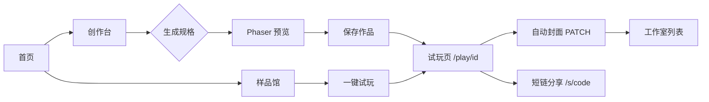
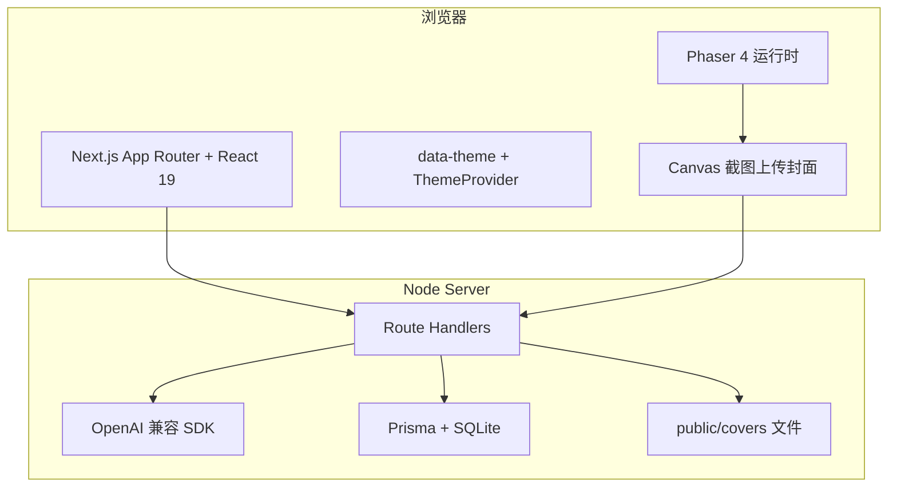
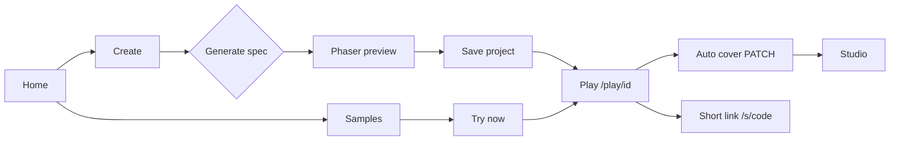
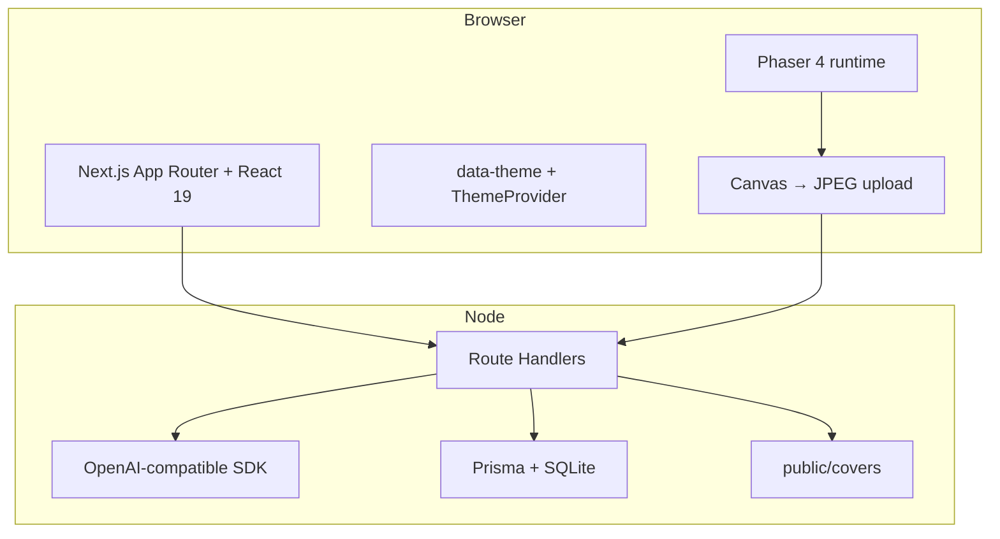

<div align="center">


# 1ONE游戏平台

**AI 驱动的浏览器小游戏创作与分享**

用自然语言描述玩法 → 结构化规格 → **Phaser** 即时试玩 → 保存、短链分享 → 社区发现与 UGC 生态。

[](https://nextjs.org/)
[](https://react.dev/)
[](https://www.prisma.io/)
[](https://phaser.io/)

</div>

**语言 / Language**：[中文文档](#目录) · [English documentation](#english-overview)

---

## 目录

- [演示与录屏](#演示与录屏)
- [产品亮点](#产品亮点)
- [界面与素材预览](#界面与素材预览)
- [核心用户路径](#核心用户路径)
- [技术架构](#技术架构)
- [功能与路由](#功能与路由)
- [快速开始](#快速开始)
- [环境变量](#环境变量)
- [数据库与迁移](#数据库与迁移)
- [API 一览](#api-一览)
- [主题与 UI](#主题与-ui)
- [样品馆与封面](#样品馆与封面)
- [开发与构建](#开发与构建)
- [CI 与部署注意](#ci-与部署注意)
- [项目结构（节选）](#项目结构节选)
- [近期进展与文档](#近期进展与文档)（含 [`docs/ai-handoff-architecture-cn.md`](docs/ai-handoff-architecture-cn.md) 给其他 AI）
- [相关说明](#相关说明)
- [English — Overview](#english-overview)

---

## 演示与录屏

> 对外演示建议准备 **60～120 秒** 成片：首页 → 创作台输入 → 流式或单次生成 → Phaser 试玩 → 保存 → 工作室出现封面。

| 类型 | 占位 | 说明 |
|------|------|------|
| **在线演示** | `https://your-demo.example.com` | 替换为实际部署地址（VPS / Docker / 内网穿透等）。 |
| **演示视频（中文）** | `[哔哩哔哩 · 待上传](https://www.bilibili.com/)` | 将链接改为你的 BV 号视频。 |
| **演示视频（英文）** | `[YouTube · TBD](https://www.youtube.com/)` | 海外受众使用。 |

**README 内嵌封面式入口（可选）**：有视频后把下面链接与缩略图换成真实地址即可（缩略图可放在 `docs/screenshots/video-cover.png`）。

```markdown
[](https://your-video-url)
```

当前用 Logo 作为占位图；上传正式封面后把 `./public/brand/logo.png` 改为你的 `docs/screenshots/video-cover.png` 即可。

---

## 产品亮点

| 能力 | 说明 |
|------|------|
| **一句话创作** | 在创作台输入描述，调用大模型生成可解析的 **GameSpec**，并驱动 Phaser 场景（塔防 / 平台跳跃等模板）。 |
| **流式与多方案** | 支持 **SSE 流式生成** 与 **并行多套备选**，便于对比不同风味。 |
| **参考素材 ingest** | 支持上传文档 / 图片或 URL，解析后合并进 Prompt（需配置 API）。含图时参考贴图写入 **sessionStorage**：默认长边 ≤1920 且 JPEG；仍超上限则 **自动多轮降画质，再不行则从末尾删张**，无需手动选择。 |
| **作品库** | 基于 **HttpOnly Cookie** 的 `ownerKey` 归属；列表、搜索、删除、**Remix 复制**。 |
| **分享** | 完整链接 + **短链** `/s/[shareCode]`；试玩页支持复制。 |
| **自动封面** | 所有者在试玩页加载后，客户端截取 **Canvas 首帧** 为 JPEG，写入 `public/covers/` 并在工作室展示。 |
| **五套全局主题（重设计）** | 与 [1oneclaw 宣传站](http://1oneclaw.com/) 一致的主题 ID、`data-theme` 与 `localStorage` 约定；五套主题（**墨蓝暗夜 / 绢白极简 / 深海电光 / 烟火琥珀 / 竹影翡翠**）深度重设计，宝石色调、冷暖分明；含全站背景动效。 |
| **样品馆** | 类画廊的横向滑动卡片，竖版封面 + 播放量风格标签 + 一键试玩 / 微调。 |
| **HUD / 试玩外壳一致性** | 由 **`theme`** 推导画布内 HUD、横幅与塔防/平台贴片色；试玩卡片映射 **`--gc-accent`** 等变量与作品同色母系；可选 **`presentation.musicProfile`** 驱动程序化铺底与蜂鸣音高微调。 |
| **生成链路并行优化** | 联网检索后对多 URL **并行抓取**正文；编排 **`qualityTier=rich`** 时 **Comfy 探活**与 **规格初稿**并行，缩短等待。 |
| **点赞系统** | 试玩页一键点赞（`POST /api/projects/[id]/like`）；幂等防刷（localStorage 记录）；点赞数实时写入数据库并在发现页与工作室展示。 |
| **UGC 发现 Feed** | `/discover` 发现广场；支持 **4 种排序**（最多试玩 / 最多点赞 / 最新发布 / 综合热度 `playCount + likeCount×3`）；Tab 切换即时刷新；封面网格展示。 |
| **首页精选预览** | `FeaturedGamesSection` 在首页内嵌展示最热 6 款作品，含封面、试玩/点赞数与「查看全部」入口，异步加载不阻塞首屏。 |
| **工作室参与度数据** | 工作室卡片底部实时展示「▶ N 次试玩」与「♥ N 点赞」，直观了解作品热度。 |
| **🎨 全模板视觉升级** | 玩家/敌人/收集物从纯色几何块升级为程序化卡通角色（眼睛、表情、高光）；塔防地图重绘为保卫萝卜风格（**沙色 3D 石板路 + 明亮草地 + 彩色花草 + 绿色建造针**）；三类炮塔各有独立卡通外形（植物系/火焰系/冰晶系）；路径终点守护目标（萝卜/水晶/基地）常显。 |
| **🗺️ 塔防路径与布局多样化** | 内置 4 种路径模板（Z / 双 U / 宽螺旋 / 波浪），由作品 hash 决定性选取；塔位均匀覆盖全路径（最小间距过滤）。 |
| **🌿 平台跳跃主题背景** | 识别标题关键词自动选择背景：太空星场 / 海洋气泡 / 森林树影 / 赛博网格 / 通用山丘。 |

---

## 界面与素材预览

以下为仓库内 **真实静态资源**（可直接在 GitHub / 本地预览 README 时渲染）。

### 品牌 Logo

<p align="center">
  
</p>

### 样品馆竖版封面（SVG 海报）

同一套数据可在 `/samples` 以画廊形式浏览；运营可将 `src/lib/samples.ts` 中的 `coverImageSrc` 替换为 WebP 截图路径。

| 萝卜守护战 | 王国边境防线 | 霓虹防火墙 | 霓虹废墟跑酷 |
|:---:|:---:|:---:|:---:|
|  |  |  |  |

### 建议自行补充的截图位

若需对外文档更「产品化」，可在仓库中新增 `docs/screenshots/` 并放入 PNG/WebP，例如：

- `docs/screenshots/home.png` — 首页主视觉  
- `docs/screenshots/create.png` — 创作台 + Phaser 预览  
- `docs/screenshots/studio.png` — 工作室卡片与封面  
- `docs/screenshots/samples.png` — 样品馆横滑  

然后在本文对应小节引用 `` 即可。

---

## 核心用户路径



---

## 技术架构



---

## 功能与路由

| 路径 | 说明 |
|------|------|
| `/` | 首页：产品介绍、精选作品预览、入口 |
| `/create` | 创作台：Prompt、参考素材、流式/多方案生成、预览、保存并跳转试玩 |
| `/studio` | 工作室：作品列表、搜索、打开、复制、删除；展示封面缩略图及试玩/点赞数 |
| `/discover` | 发现广场：UGC Feed，4 种排序（最多试玩 / 最多点赞 / 最新发布 / 综合热度） |
| `/samples` | 样品馆：分区横滑、试玩 / 微调 |
| `/play/[id]` | 试玩页：元信息、分享、点赞、Remix、Phaser 全屏；**所有者**触发封面采集 |
| `/s/[code]` | 短链跳转试玩 |

---

## 快速开始

**环境**：Node.js **18+**（推荐与 CI 一致的 **22**）、npm。

```bash
# 安装依赖（会自动 prisma generate）
npm ci

# 配置环境变量（至少 DATABASE_URL；生成能力需配置 OpenAI 兼容项）
copy .env.example .env   # Windows
# cp .env.example .env  # macOS / Linux

# 应用数据库迁移（本地开发）
npx prisma migrate dev

# 启动开发服务（脚本已固定端口 8888，无需再传 -p）
npm run dev
```

浏览器打开 **http://localhost:8888** 即可（若 8888 已被占用，Next 会在终端提示并改用其它端口）。若仅未配置模型密钥，部分生成接口会走项目内 **mock / 规则推断**（行为以运行时提示为准）。

**与手机同局域网调试时**，`localhost` 与 `192.168.x.x` 在浏览器里算**不同站点**，`localStorage` / `sessionStorage` / HttpOnly Cookie **不共享**。要在电脑与手机上看到**完全一致**的主题、参考图与「我的作品」，请二选一：

1. **推荐**：在本机 `.env.local` 写入 `NEXT_PUBLIC_DEV_CANONICAL_ORIGIN=http://你的局域网IP:8888`（端口以终端为准），然后**电脑与手机都只用这个地址**打开；开发模式下若当前地址与该行不一致，底部会出现**一键切换**提示。  
2. **更彻底（可选）**：再设 `DEV_FORCE_CANONICAL_ORIGIN=1`，从 `localhost` 进入会被**自动重定向**到上述统一地址（需在 `.env.example` 末尾有说明）。

---

## 环境变量

复制 `.env.example` 为 `.env` 后按需填写。常用项如下：

| 变量 | 说明 |
|------|------|
| `DATABASE_URL` | SQLite 连接串，默认 `file:./dev.db`（相对 `prisma` 目录） |
| `OPENAI_API_KEY` | 兼容 OpenAI SDK 的密钥 |
| `OPENAI_BASE_URL` | 网关根地址（可对接 LiteLLM / OpenClaw 等） |
| `OPENAI_MODEL` | 主模型 ID |
| `OPENAI_MODEL_FALLBACKS` | 备用模型，逗号分隔 |
| `OPENAI_EXTRA_HEADERS_JSON` | 可选额外请求头 JSON |
| `OPENAI_USER_AGENT` | 部分网关校验 UA 时使用 |

---

## 数据库与迁移

- **ORM**：Prisma  
- **默认数据库**：SQLite（文件库，适合单机与快速迭代）  
- **核心模型**：`Project`（`ownerKey`、`specJson`、`shareCode`、`coverPath`、`playCount Int @default(0)`、`likeCount Int @default(0)` 等）

```bash
npx prisma migrate dev    # 开发：改 schema 后生成并应用迁移
npx prisma migrate deploy # 生产/CI：仅应用已有迁移
npx prisma db push        # 无迁移文件时的快速对齐（团队规范优先 migrate）
```

---

## API 一览

| 方法 | 路径 | 说明 |
|------|------|------|
| `GET` | `/api/health` | 健康检查 |
| `POST` | `/api/generate` | 单次生成 GameSpec |
| `POST` | `/api/generate/stream` | SSE 流式生成 |
| `POST` | `/api/generate/variants` | 并行多套方案 |

**`POST /api/generate*` 补充说明**：正文可选 **`assetManifest`**（会话参考图元数据：`schemaVersion` / `revision` / `itemCount`）；响应头 **`x-request-id`**；超限 **413**（`code: BODY_TOO_LARGE`）、限流 **429**（`code: RATE_LIMITED`）；更多见 **`.env.example`** 与 [开发与构建](#开发与构建)。

| `POST` | `/api/ingest` | 参考素材解析（multipart） |
| `GET` | `/api/projects` | 当前会话作品列表（含 `playCount`、`likeCount`） |
| `POST` | `/api/projects` | 新建作品 |
| `GET` | `/api/projects/[id]` | 作品详情 + Spec |
| `PATCH` | `/api/projects/[id]` | 更新标题、短链、**封面 JPEG（base64）** |
| `DELETE` | `/api/projects/[id]` | 删除作品及封面文件 |
| `POST` | `/api/projects/[id]/duplicate` | 复制作品（含封面文件） |
| `POST` | `/api/projects/[id]/like` | 点赞（幂等，通过 localStorage 防刷） |
| `POST` | `/api/projects/[id]/play` | 增加试玩计数 |
| `GET` | `/api/discover` | UGC 发现 Feed；`sort=playCount\|likeCount\|createdAt\|hot`；`limit=1-96`（默认 48） |

---

## 主题与 UI

- 五套主题（**墨蓝暗夜**、**绢白极简**、**深海电光**、**烟火琥珀**、**竹影翡翠**）深度重设计：宝石色调、冷暖分明、背景更深邃、对比更克制（定义见 `src/lib/themes.ts`）。  
- 根节点使用 **`data-theme`**，持久化键为 **`theme`**（见 `ThemeProvider` 与首屏内联脚本）。  
- 全站背景动效与噪点层对齐 **1oneclaw** 宣传站风格（`globals.css` + `layout.tsx`）。  
- 开发环境下已通过 `next.config.ts` 的 **`devIndicators: false`** 关闭右下角指示器（可按需改回）。

---

## 样品馆与封面

- **样品数据**：`src/lib/samples.ts` — 含 `coverImageSrc`、`coverAlt`、分区 `shelf` 等，便于运营改物料。  
- **用户作品封面**：试玩页内 Phaser `canvas` → 缩放 JPEG → `PATCH` 写入 `public/covers/{id}.jpg`；**无持久化磁盘的 Serverless 环境**需改为对象存储或 CDN URL（当前仓库以本地/容器卷为假设）。  
- **`.gitignore`**：忽略 `public/covers/*.jpg`，保留 `public/covers/.gitkeep`。

---

## 开发与构建

| 命令 | 说明 |
|------|------|
| `npm run dev` | 本地开发；`package.json` 已配置 **`next dev -p 8888`**，默认 **http://localhost:8888**，减少与常见 3000 端口冲突。 |
| `npm run build` | 生产构建（`next build`；首次 `npm ci` 时 `postinstall` 会执行 `prisma generate`）。 |
| `npm run build:full` | 显式 `prisma generate && next build`（CI 或改 schema 后想手动跑一遍时可用）。 |
| `npm run start` | 生产模式启动 **`next start`**，默认监听 **3000**；可用环境变量 **`PORT`** 覆盖（如 `set PORT=4000` 后 `npm run start`，命令因系统而异）。 |
| `npm run lint` | ESLint |
| `npm run qa:orch-smoke` | 编排冒烟：`mockSpecFromPrompt` + `lintGameSpecForOrchestration`（tsx） |
| `npm run test:e2e` | Playwright：默认走 **`npm run dev`（8888）**；本地生产形态可先 **`npm run build`** 再运行 **`PW_START=1 npm run test:e2e`**（等价于 **`next start` + PORT=8888**，与 CI 一致） |

首次本机跑 E2E 需 **`npx playwright install chromium`**（CI 已由 workflow 安装）。

**请求侧可观测**：生成类路由在 **`GENERATE_STRUCTURED_LOG=1`** 时向 stdout 打一行的 JSON（含 `requestId`、耗时、条目数摘要等）。

**单机限流**（`/api/generate*`）：按 **Cookie/ownerKey + IP** 在进程内计数（`GENERATE_RL_POST_MAX`、`GENERATE_RL_STREAM_MAX`、`GENERATE_RL_VARIANTS_MAX`、`GENERATE_RL_WINDOW_MS`）；多副本或无状态时请改用 **网关 / Redis**，勿依赖单机内存窗口。

**创作台参考图**：解析出的位图会写入浏览器 **sessionStorage**（键由 `src/lib/assets/reference-image-payloads.client.ts` 管理）。策略为 **先尝试原样写入 → 多轮降低 JPEG 质量 → 仍失败则每次去掉队列末尾一张并重试**，直至写入成功或清空；界面会给出简要提示（如已降画质 / 已删尾张）。**含 Alpha 的 PNG/WebP/WebM 帧等在会话侧优先保留透明通道**（避免不当铺白底转 JPEG 导致试玩出现整块浅色框）。**塔防模板**（`towerDefense`）下用途关键词会驱动试玩贴图：背景类（如「背景地图」）作全屏底图，**怪物**类作敌军，`主角` / `玩家` / `萝卜` / `水晶` 等作**路径终点需保护形象**；**塔/箭塔**等仅排除在怪贴图外（塔位仍用内置占位，皮肤可后续再接）。

**Docker**：仓库内 `Dockerfile` / `docker-compose` 面向生产 **`next start`**，容器内仍为 **3000**；与本地 **`npm run dev` → 8888** 互不冲突。

---

## CI 与部署注意

- **GitHub Actions**（`.github/workflows/ci.yml`）：**并行** `quality`（`lint` + `qa:orch-smoke`）与 `bundle-e2e`（`prisma migrate` → `build` → `PW_START=1` 下 Playwright）。  
- **封面文件**：部署多实例或无本地写权限时，需将封面上传逻辑对接 **S3 / OSS** 等，并把 `coverPath` 存为可公开访问的 URL。  
- **Phaser**：已在 `next.config.ts` 中 `transpilePackages: ["phaser"]`。  
- **服务端依赖**：`pdf-parse`、`mammoth` 等见 `serverExternalPackages` 配置。

---

## 项目结构（节选）

```text
game/
├── prisma/
│   ├── schema.prisma
│   └── migrations/
├── public/
│   ├── brand/logo.png
│   ├── samples/           # 样品馆默认 SVG 封面
│   └── covers/            # 用户作品自动截图（git 忽略 *.jpg）
├── src/
│   ├── app/               # App Router 页面与 API
│   ├── components/        # 布局、主题、GamePlayer 等
│   ├── game/engine/       # Phaser 场景与工厂
│   ├── lib/               # Spec、主题、封面工具、Prisma 等
│   └── providers/         # 全站底层能力根：AppCapabilitiesRoot（主题 + 剪贴板图队列 + 开发期提示）
├── docs/                  # 编排说明、进展纪要、AI 接手稿（架构）
├── .env.example
├── next.config.ts
└── README.md
```

---

## 近期进展与文档

| 文档 | 说明 |
|------|------|
| [`docs/ai-handoff-architecture-cn.md`](docs/ai-handoff-architecture-cn.md) | **给其他 AI / 协作者**：进展摘要 + **当前架构**（含 Mermaid）+ 源码索引与约束 |
| [`docs/recent-progress.md`](docs/recent-progress.md) | **近期迭代纪要**：视觉大升级 / 一致性 / 程序化音频 / 参考图管线 / 编排并行等 |
| [`docs/architecture-orchestration.md`](docs/architecture-orchestration.md) | **编排 Phase 0～4**、RunTrace、Comfy 探活、冒烟与 CI |
| [`ai_game_generation_platform_architecture_cn.md`](ai_game_generation_platform_architecture_cn.md) | **中长期平台架构设想**（多 Agent、资产协议等），与当前仓库轻量落地对照阅读 |

### 最近新增（本期迭代）

| 日期 | 变更 |
|------|------|
| 2026-05 | **🎨 视觉全面升级**：全模板程序化贴图重写（玩家/敌人卡通角色化）；塔防地图升级为保卫萝卜风格（沙色石板路 + 明亮草地 + 彩色花草 + 绿色建造针）；三类炮塔各有独立卡通外形（植物系/火焰系/冰晶系）；敌人恢复真实纹理颜色；终点守护目标常显（胡萝卜/水晶/基地）。 |
| 2026-05 | **🗺️ 塔防路径多样化**：内置 4 种路径模板（Z 形 / 双 U / 宽螺旋 / 波浪），由标题 hash 决定性选取；塔位按最小间距均匀分布全路径。 |
| 2026-05 | **🌿 平台跳跃背景主题化**：识别关键词自动选择背景风格（太空星场 / 海洋气泡 / 森林剪影 / 赛博网格 / 通用山丘）。 |
| 2026-05 | **五套主题深度重设计**：墨蓝暗夜 / 绢白极简 / 深海电光 / 烟火琥珀 / 竹影翡翠，宝石色调替换霓虹，冷暖分明。 |
| 2026-05 | **发现广场 `/discover`**：UGC Feed，4 种排序（最多试玩 / 最多点赞 / 最新发布 / 综合热度），Tab 切换即时刷新。 |
| 2026-05 | **点赞系统**：`POST /api/projects/[id]/like`，幂等防刷，点赞数写入 DB 并全站展示。 |
| 2026-05 | **首页精选预览**：`FeaturedGamesSection` 异步加载最热 6 款，封面 + 热度数据 + 直达入口。 |
| 2026-05 | **工作室参与度数据**：卡片底部「▶ N 次试玩 / ♥ N 点赞」实时统计。 |
| 2026-05 | **数据模型扩展**：`Project` 新增 `playCount Int @default(0)` 与 `likeCount Int @default(0)`。 |

---

## 相关说明

- 全站底层能力（**主题**、`data-theme`、**全局剪贴板图片队列**）在 `src/app/layout.tsx` 经 **`AppCapabilitiesRoot`** 挂载；业务页请使用 `useTheme`、`useClipboardImageQueue`，避免在单页重复监听 `paste`。剪贴板解析工具见 `src/lib/capabilities/extractClipboardImages.ts`。
- 本项目使用 **Next.js 16**，部分约定可能与旧版文档不同；开发前可参考仓库规则（如 `AGENTS.md`）与官方升级指南。  
- 对外品牌名与 Logo 配置见 `src/lib/brand.ts`。  
- 若需对接 **OpenClaw / LiteLLM**，优先对齐 `.env.example` 中的注释示例。

---

<a id="english-overview"></a>

## English — Overview

**1ONE Game Lab** — AI-assisted creation of small browser games: describe gameplay in natural language, get a structured **GameSpec**, run it instantly with **Phaser**, then save, share (full URL + short link), manage projects in **Studio**, and discover community games in the **UGC Feed**. Themes and gallery UX align with the [1oneclaw](http://1oneclaw.com/) marketing site palette and patterns.

### Language

- This section mirrors the Chinese README above.  
- For screenshots and brand assets, the same `./public/...` paths apply.

### Demo & screen recording

| Kind | Placeholder |
|------|-------------|
| Live demo | `https://your-demo.example.com` |
| Video (CN) | Upload to Bilibili and link here |
| Video (EN) | Upload to YouTube and link here |

Optional click-to-play row (replace URL and thumbnail when ready):

```markdown
[](https://your-video-url)
```

### Key features

| Feature | Description |
|--------|-------------|
| **Prompt → game** | LLM produces a parseable **GameSpec** driving Phaser (tower defense, platformer, etc.). |
| **Streaming & variants** | **SSE** streaming and **parallel variant** generation. |
| **Cohesive HUD & shell** | **Theme** drives in-canvas HUD/banners and TD/platform tints; the play card maps **`--gc-*`** to match; optional **`presentation.musicProfile`** drives **procedural bed** + bleep temperament. |
| **Faster generation I/O** | **Parallel** fetch of web-search result pages; when **orchestration quality tier is rich**, **Comfy probe** runs **in parallel** with **spec draft** (see `docs/recent-progress.md`). |
| **Reference ingest** | Upload docs/images or paste URLs; merged into the prompt (API required). Image payloads go to **sessionStorage** (long edge ≤1920, JPEG); if still too large, **auto multi-pass quality reduction**, then **drop from the end** until it fits—no modal. |
| **Project library** | **HttpOnly cookie** `ownerKey`; list, search, delete, **duplicate / Remix**. |
| **Sharing** | Full play URL + short path `/s/[shareCode]`. |
| **Auto cover** | Owner’s play session captures the **first Phaser frame** as JPEG → `public/covers/{id}.jpg` → shown in Studio. |
| **5 themes (redesigned)** | Same IDs as 1oneclaw: **Midnight Blue / Parchment / Cyber Blue / Amber / Forest Jade** — all five themes redesigned with jewel-tone accents, distinct warm/cool palettes, deeper dark backgrounds (`data-theme` + `localStorage`). |
| **Samples gallery** | Horizontal shelves, portrait covers, one-tap try & refine. |
| **Like system** | One-tap like on play page (`POST /api/projects/[id]/like`); idempotent via localStorage; count persisted in DB, shown in Discover and Studio. |
| **UGC Discover Feed** | `/discover` feed with **4 sort modes** (most played / most liked / newest / hot composite `playCount + likeCount×3`); tab switching triggers instant refresh. |
| **Featured games on home** | `FeaturedGamesSection` shows top-6 games on the landing page with covers, stats, and a "View all" link; async, non-blocking. |
| **Studio engagement stats** | Studio cards display "▶ N plays" and "♥ N likes" so creators track popularity at a glance. |

### Screenshots (in-repo assets)

| Radish TD | Kingdom TD | Cyber TD | Neon platformer |
|:---:|:---:|:---:|:---:|
|  |  |  |  |

Add under `docs/screenshots/` for marketing-grade UI captures and reference them here.

### User journey



### Architecture



### Routes

| Path | Purpose |
|------|---------|
| `/` | Landing + featured games preview |
| `/create` | Editor: prompt, ingest, stream/variants, preview, save |
| `/studio` | Project list, search, thumbnails, play/like stats |
| `/discover` | UGC Feed: 4 sort modes (most played / most liked / newest / hot) |
| `/samples` | Gallery-style samples |
| `/play/[id]` | Play, share, like, Remix; **owner** triggers cover capture |
| `/s/[code]` | Short link resolver |

### Quick start

Requires **Node.js 18+** (CI uses **22**).

```bash
# Install deps (postinstall runs prisma generate)
npm ci

# Env: at least DATABASE_URL; LLM keys for real generation
cp .env.example .env    # or: copy .env.example .env on Windows

# Apply DB migrations (local dev)
npx prisma migrate dev

# Dev server fixed to port 8888 in package.json (no extra -p flag needed)
npm run dev
```

Dev server listens on **`http://localhost:8888`** by default (`npm run dev` runs `next dev -p 8888` in `package.json`; no extra `-p` needed). If 8888 is busy, Next prints the actual port. Without API keys, some flows fall back to **mock / heuristic** generation.

**Phone + PC same Wi‑Fi:** `localhost` and `http://192.168.x.x` are **different origins**—`localStorage`, `sessionStorage`, and cookies do **not** sync. For an identical experience across devices, set `NEXT_PUBLIC_DEV_CANONICAL_ORIGIN=http://YOUR_LAN_IP:8888` in `.env.local` and open **only that URL** on both machines; a dev-only bottom banner offers one-click navigation. Optional: `DEV_FORCE_CANONICAL_ORIGIN=1` auto-redirects mismatched dev hosts to that origin.

### Environment variables

See `.env.example`. Main entries: `DATABASE_URL`, `OPENAI_API_KEY`, `OPENAI_BASE_URL`, `OPENAI_MODEL`, `OPENAI_MODEL_FALLBACKS`, optional `OPENAI_EXTRA_HEADERS_JSON`, `OPENAI_USER_AGENT`.

### Database

- **Prisma** + **SQLite** by default.  
- Model **`Project`**: `ownerKey`, `specJson`, `shareCode`, `coverPath`, `playCount Int @default(0)`, `likeCount Int @default(0)`, timestamps.

```bash
npx prisma migrate dev
npx prisma migrate deploy
```

### API summary

| Method | Path | Notes |
|--------|------|--------|
| `GET` | `/api/health` | Health |
| `POST` | `/api/generate` | Single generation |
| `POST` | `/api/generate/stream` | SSE |
| `POST` | `/api/generate/variants` | Parallel variants |

**`POST /api/generate*` extras**: optional **`assetManifest`** (`schemaVersion` / `revision` / `itemCount`); **`x-request-id`** response header; **413** (**`BODY_TOO_LARGE`**) / **429** (**`RATE_LIMITED`**) JSON `code`; see **`.env.example`**.

| `POST` | `/api/ingest` | Reference ingest |
| `GET`/`POST` | `/api/projects` | List (incl. `playCount`, `likeCount`) / create |
| `GET`/`PATCH`/`DELETE` | `/api/projects/[id]` | Detail, title/share/cover, delete |
| `POST` | `/api/projects/[id]/duplicate` | Clone (+ cover file) |
| `POST` | `/api/projects/[id]/like` | Like (idempotent via localStorage) |
| `POST` | `/api/projects/[id]/play` | Increment play count |
| `GET` | `/api/discover` | UGC Feed; `sort=playCount\|likeCount\|createdAt\|hot`; `limit=1-96` (default 48) |

### Themes & UI

Themes live in `src/lib/themes.ts` and `globals.css`. Five themes redesigned: **Midnight Blue** (`dark`), **Parchment** (`light`), **Cyber Blue** (`cyber-blue`), **Amber** (`warm-orange`), **Forest Jade** (`forest-green`) — jewel tones over neon, deeper dark backgrounds. Dev overlay indicator is disabled via `devIndicators: false` in `next.config.ts` (change if you want the Next.js dev badge back).

### Samples & covers

- Sample rows: `src/lib/samples.ts` (`coverImageSrc`, `coverAlt`, `shelf`).  
- User covers: written under `public/covers/` — on **ephemeral serverless** hosts, switch to **object storage** and store a public URL in `coverPath`.

### Scripts

| Script | Notes |
|--------|--------|
| `npm run dev` | `next dev -p 8888` — default **http://localhost:8888** |
| `npm run build` | `next build` (`prisma generate` runs on `npm ci` via `postinstall`) |
| `npm run build:full` | `prisma generate && next build` |
| `npm run start` | `next start` — default port **3000**; override with **`PORT`** |
| `npm run lint` | ESLint |
| `npm run qa:orch-smoke` | Orchestration smoke (tsx) |
| `npm run test:e2e` | Playwright (**dev** locally; **`PW_START=1`** runs **`next start`** on **8888** after `npm run build`, matching CI). First run locally: **`npx playwright install chromium`** |

Structured logs when **`GENERATE_STRUCTURED_LOG=1`** — see `.env.example`. In-memory rate limits are per-instance; scale out needs Redis/KV.

**Create / reference images:** blobs are stored in **sessionStorage** with automatic **recompress → drop last** until write succeeds or cleared; **PNG/WebP alpha is preserved where possible** (see `docs/recent-progress.md`). See `src/lib/assets/reference-image-payloads.client.ts`.

**Tower defense preview (`towerDefense`):** optional `purpose` strings map uploads to layers—background phrases (e.g. map/backdrop), **monster**/enemy phrases for creep sprites, **protagonist** / carrot / crystal style phrases for the **VIP at path end**, and tower-only phrases excluded from creep cycling (tower art can be wired later).

**Docker:** `Dockerfile` / compose target **`next start`** on port **3000** inside the container; local **`npm run dev`** uses **8888** — no conflict.

### CI & deployment

- GitHub Actions: parallel **`quality`** (lint + orch smoke) and **`bundle-e2e`** (prisma → build → Playwright with **`PW_START=1`**). See `.github/workflows/ci.yml`.
- **Phaser** is transpiled via `next.config.ts`.  
- **Covers**: use durable storage in multi-instance production.

### Repository layout (excerpt)

```text
prisma/          schema + migrations
public/brand     logo
public/samples   default sample art
public/covers    auto thumbs (jpg gitignored)
src/app          pages + API routes
src/providers    AppCapabilitiesRoot (theme + clipboard queue + dev banner)
src/game/engine  Phaser scenes
src/lib          spec, themes, prisma helpers, cover utils
```

### Docs & roadmap

| Doc | Purpose |
|-----|---------|
| [`docs/ai-handoff-architecture-cn.md`](docs/ai-handoff-architecture-cn.md) | **Handoff for other AIs**: progress + **current architecture** (Mermaid) + source index |
| [`docs/recent-progress.md`](docs/recent-progress.md) | Recent feature summary — **visual engine upgrade**, consistency, audio, ingest, orchestration parallelism |
| [`docs/architecture-orchestration.md`](docs/architecture-orchestration.md) | Orchestration phases & traces |
| [`ai_game_generation_platform_architecture_cn.md`](ai_game_generation_platform_architecture_cn.md) | Long-term platform architecture vision (multi-agent, asset protocols); broader than current repo scope |

### Recent additions (latest sprint)

| Date | Change |
|------|--------|
| 2026-05 | **🎨 Full visual engine upgrade** — all templates: cartoon player/enemy/collectible sprites; tower defense redrawn in Radish Defense style (**sandy 3D stone path + bright grass with flowers + green build pins**); 3 tower types as distinct cartoon characters (plant/fire/ice); enemy textures restored; goal object always visible. |
| 2026-05 | **🗺️ TD path & slot diversity** — 4 path templates (Z / double-U / spiral / wave), deterministically chosen by title hash; tower slots filtered by min spacing for even distribution. |
| 2026-05 | **🌿 Platformer themed backgrounds** — keyword detection for space / ocean / forest / cyber / generic hill backgrounds. |
| 2026-05 | **5 themes redesigned** — jewel-tone accents, deeper darks, warm/cool palettes cleanly separated. |
| 2026-05 | **UGC Discover Feed `/discover`** — 4 sort modes: most played / most liked / newest / hot composite. |
| 2026-05 | **Like system** — idempotent `POST /api/projects/[id]/like` with localStorage dedup; counts in DB. |
| 2026-05 | **Home featured section** — top-6 games shown on landing page; async, zero blocking. |
| 2026-05 | **Studio engagement stats** — play/like counts shown per card. |
| 2026-05 | **Data model**: `Project` gains `playCount Int @default(0)` and `likeCount Int @default(0)`. |

### Notes

- **App shell:** `AppCapabilitiesRoot` in `layout.tsx` wires **theme** + **global clipboard image queue** (`useTheme`, `useClipboardImageQueue`); reuse `extractClipboardImages` instead of ad-hoc paste parsing.  
- Next.js **16** may differ from older docs; see `AGENTS.md` / official upgrade guides.  
- Brand strings: `src/lib/brand.ts`.  
- OpenClaw / LiteLLM: follow comments in `.env.example`.

---

<div align="center">

**1ONE游戏平台** · 让一句话变成可玩版本 · *One prompt, one playable build*

</div>
