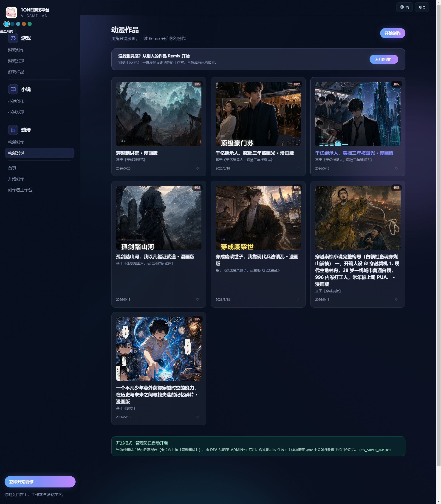
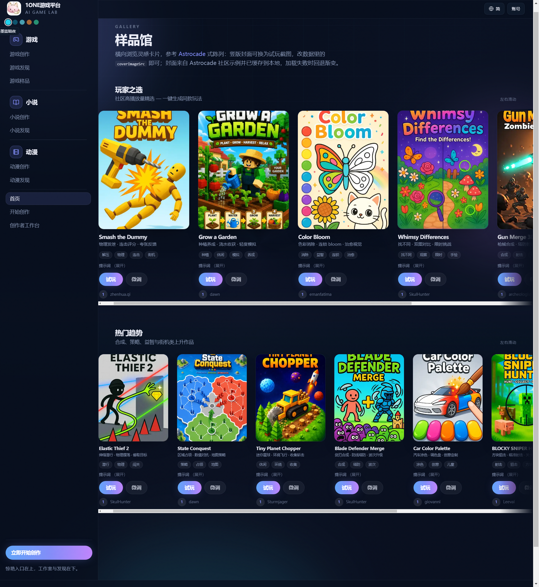
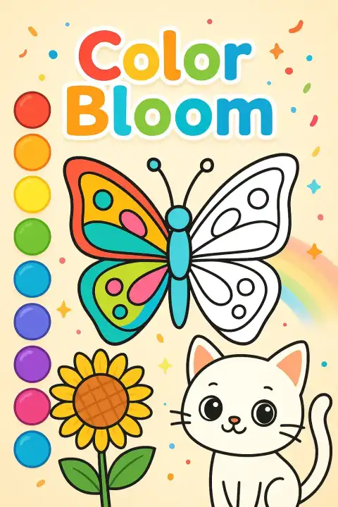
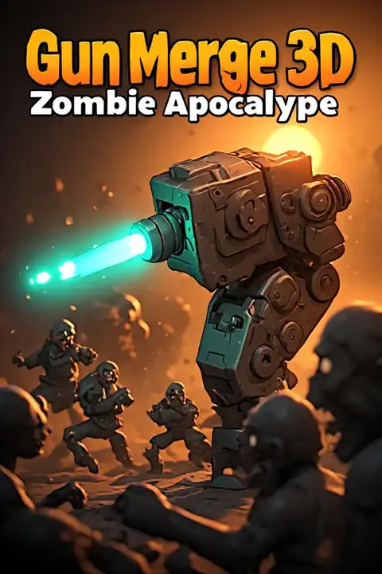
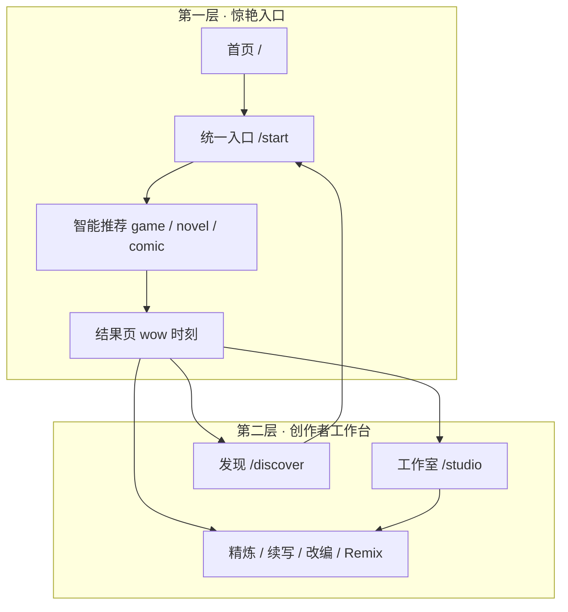
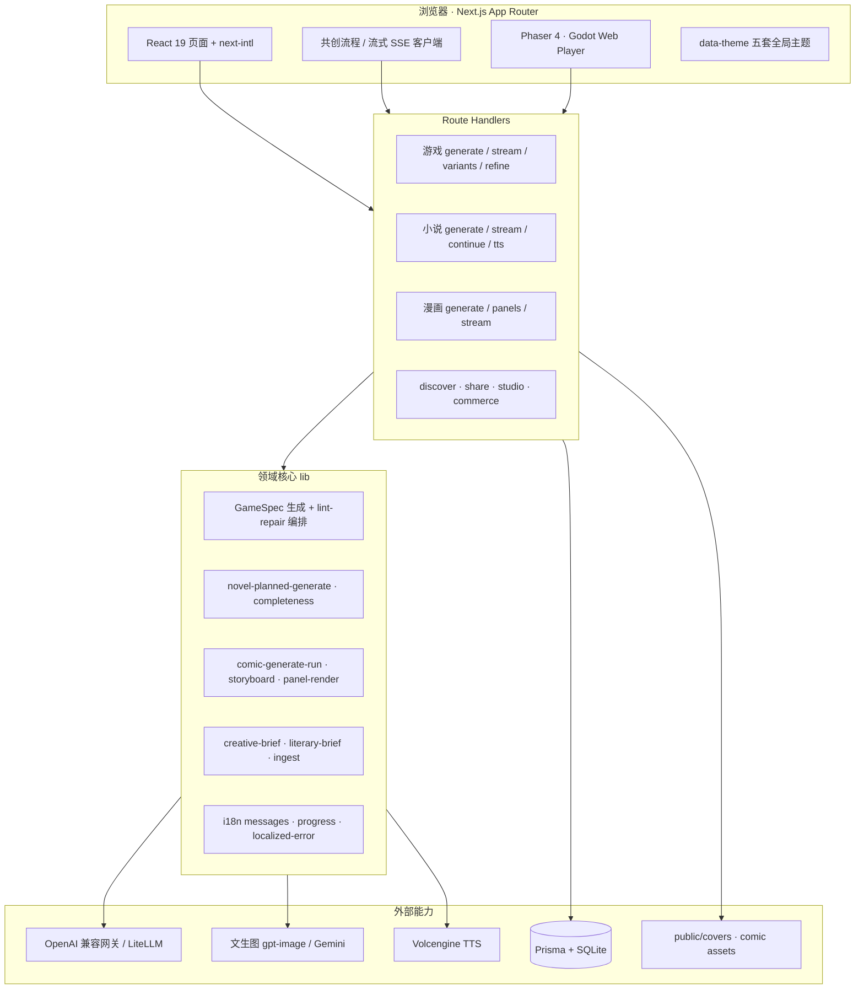

<div align="center">


# Operone 创作平台

**一句话 → 可玩游戏 · 可读小说 · 可看漫画**

AI 与规格驱动的一体化创作实验室：从灵感输入到试玩/阅读/分镜配图，再到工作室管理与社区发现，全链路可在浏览器内完成。

[](https://nextjs.org/)
[](https://react.dev/)
[](https://www.prisma.io/)
[](https://phaser.io/)
[](https://godotengine.org/)

[快速开始](#快速开始) · [产品截图](#产品截图) · [架构概览](#架构概览) · [English](#english-overview)

</div>

---

## 目录

- [我们是谁](#我们是谁)
- [平台能力一览](#平台能力一览)
- [产品截图](#产品截图)
- [双层产品结构](#双层产品结构)
- [架构概览](#架构概览)
- [多语言与国际化](#多语言与国际化)
- [创作流水线](#创作流水线)
- [功能与路由](#功能与路由)
- [技术栈](#技术栈)
- [快速开始](#快速开始)
- [模型与配置](#模型与配置)
- [环境变量](#环境变量)
- [开发与 QA](#开发与-qa)
- [项目结构](#项目结构)
- [相关文档](#相关文档)
- [English — Overview](#english-overview)

---

## 我们是谁

**Operone 创作平台**（AI GAME LAB）不是单一的「小游戏生成器」，而是一套 **游戏 + 小说 + 漫画** 共用的 AI 创作基础设施：

| 维度 | 说明 |
|------|------|
| **面向谁** | 想快速验证创意的个人创作者、教学演示、独立开发试玩、UGC 社区 |
| **交付什么** | 结构化 **GameSpec** 即时试玩、分章节小说正文、分镜 + 配图漫画 |
| **怎么做到** | LLM 编排 + 规格校验修复 + 流式 SSE + 参考图/联网增强 + 多引擎运行时 |
| **体验原则** | **先给惊艳结果，再深度打磨** — 入口极简，工作室承接进阶 |

---

## 平台能力一览

### 产品亮点

<table>
<tr>
<td width="50%" valign="top">

**三模态一体**  
同一句灵感可走向游戏、小说或漫画；小说可一键改编为漫画，工作室追踪连载改编进度。

</td>
<td width="50%" valign="top">

**4 步共创式游戏**  
输入创意 → 提炼意图 → 挑选方向 → 生成可玩版本；支持 SSE 流式、并行 3 套备选。

</td>
</tr>
<tr>
<td width="50%" valign="top">

**双轨游戏运行时**  
**Phaser** 秒级预览 + **Godot Web** 完整导出；六类玩法模板程序化视觉升级。

</td>
<td width="50%" valign="top">

**小说 planned pipeline**  
短篇/中篇/长篇：世界观 Bible → 章纲 → 流式写作 → **完整性校验**（结局、章数、字数）。

</td>
</tr>
<tr>
<td width="50%" valign="top">

**漫画工业化流水线**  
轻量/导演分镜、Character Sheet 人设一致、分镜 checkpoint 断点续跑、批量 panel 配图。

</td>
<td width="50%" valign="top">

**参考素材 ingest**  
文档/图片/URL 解析合并进 Prompt；塔防等模板按用途自动贴图。

</td>
</tr>
<tr>
<td width="50%" valign="top">

**五语系 i18n**  
`zh-Hans` / `zh-Hant` / `en` / `ms` / `th` — 路由、UI、API 进度与错误消息按 locale 返回。

</td>
<td width="50%" valign="top">

**UGC 与 Remix**  
发现广场多维度排序、点赞/试玩统计、样品馆横滑画廊、短链分享 `/s/[code]`。

</td>
</tr>
<tr>
<td width="50%" valign="top">

**编排与可观测**  
Phase 0～4 编排框架、RunTrace、Comfy 探活并行、结构化生成日志。

</td>
<td width="50%" valign="top">

**产品参数代码化**  
模型、超时、篇幅、限流集中在 `src/lib/product-config.ts`，部署只需密钥与网关。

</td>
</tr>
<tr>
<td colspan="2" valign="top">

**自动化 QA** — 多语回归、`/en/` 路径验收、planned 小说 E2E、Godot 导出矩阵、Playwright CI

</td>
</tr>
</table>

---

## 产品截图

> 以下均为仓库内真实界面截图（`src/png/`），可直接在 GitHub 预览。

### 首页 — 惊艳入口

<p align="center">
  
</p>

**首页**聚焦「一句话，立刻变成可玩、可读、可看的内容」。左侧导航按 **游戏 / 小说 / 动漫** 组织创作与发现；右侧 **三步到达惊艳时刻**：说出灵感 → AI 出结果 → 试玩/阅读/发布。底部强调 **双层产品**：惊艳入口在上，工作室与发现在下。

---

### 统一创作入口 — 智能推荐载体

<p align="center">
  
</p>

**`/start` 统一入口**：用户无需先选类型，系统根据灵感推荐 **游戏 / 小说 / 漫画** 最优载体（可手动切换）。卡片展示预估耗时：游戏约 1～3 分钟、短篇小说 3～8 分钟、漫画 5～40 分钟（含分镜与配图）。

---

### 游戏创作台 — 4 步共创 + 双引擎

<p align="center">
  
</p>

<p align="center">
  
</p>

**游戏创作台**（`/create`）提供 **Godot 在线 / Phaser** 双引擎切换、4000 字创意描述、参考图用途标注（背景/怪物/塔/守护目标）、玩法模板、二次强化、**Tavily 联网检索**、URL/文档解析追加。底部 **4 步进度条** 与并行「一次生成 3 套备选」。

---

### AI 小说创作 — 类型 × 篇幅 × 流式写作

<p align="center">
  
</p>

**小说创作**（`/novel/create`）四步流程：**书名与类型 → AI 扩写构思 → 流式写作 → 封面与发布**。11 种题材标签 + 短篇/中篇/长篇三档篇幅；中篇约 5～15 分钟，长篇支持分段续写（目标约 8 万字级）。

---

### AI 漫画创作 — 画风 × 精读模式 × 人设一致

<p align="center">
  
</p>

**漫画创作**（`/comic/create`）支持粘贴整篇正文或一句话创意；**6 种画风预设**（日系/国漫/Q 版/儿童绘本等）、段落精读/全书精读、**人设存档**保证跨格角色一致。先生成分镜，配图在详情页批量渲染。

---

### 创作者工作台 — 不止仓库，更是下一步指引

<p align="center">
  
</p>

**`/studio`** 展示最近创作、待完善项（如补封面/配图）、**下一步建议**（Remix / 续写 / 改编），以及 **连载改编进度**（小说 → 漫画章节完成度）。

---

### 发现广场 — UGC 与 Remix 转化

<p align="center">
  
</p>

<p align="center">
  
</p>

<p align="center">
  
</p>

**发现页**按载体分栏：游戏支持题材筛选 + 试玩/点赞/最新/综合排序；小说与漫画卡片含 AI 封面、简介与 **一键 Remix** 转化条，降低「从逛到创」的门槛。

---

### 样品馆 — 画廊式试玩与克隆

<p align="center">
  
</p>

<p align="center">
  
  
  
  
  
</p>

**`/samples` 样品馆** 以横滑卡片展示社区精选与热门趋势（竖版封面主资源在 `public/samples/astrocade/`，4:5 WebP/JPG）；每张卡片 **试玩 + 克隆**，适合教学演示与快速体验平台能力。图片加载失败时回退渐变底衬；`public/samples/*.svg` 为 Operone 品牌占位海报（渐变回退备用）。

---

## 双层产品结构



| 层级 | 目标 | 代表页面 |
|------|------|----------|
| **第一层** | 30 秒内看到成果 | `/` · `/start` · `/play` · `/novel/[id]` · `/comic/[id]` |
| **第二层** | 长期创作与运营 | `/studio` · `/discover` · `/admin` · 精炼 / 副本 / 分享 |

产品 IA 配置见 [`src/lib/product-ia.ts`](src/lib/product-ia.ts)，规格说明见 [`docs/specs/2026-06-08-1one-product-redesign.md`](docs/specs/2026-06-08-1one-product-redesign.md)。

---

## 架构概览



### 编排框架（游戏生成）

采用 **规格驱动运行时 + DAG 编排**（Phase 0～4 已落地）：

| Phase | 能力 |
|-------|------|
| **0** | ContextPack、RunTraceRecorder、联网 URL 并行抓取 |
| **1** | `lintGameSpecForOrchestration` + 多轮 repair |
| **2** | AssetManifestV1 参考图元数据与会话同步 |
| **3** | Comfy 探活与 spec 初稿 **并行**（rich 档位） |
| **4** | `qa:orch-smoke` + Playwright CI |

详见 [`docs/architecture-orchestration.md`](docs/architecture-orchestration.md)。

### 数据模型（节选）

| 模型 | 用途 |
|------|------|
| `Project` | 游戏 specJson、封面、试玩/点赞、shareCode |
| `Novel` | 正文、篇幅档、summary、visibility |
| `Comic` | 分镜 JSON、配图 URL、关联 novelId |
| `User` / 商业化 | OAuth、额度、订单（Phase 3～4） |

Schema：`prisma/schema.prisma` · 迁移：`prisma/migrations/`。

---

## 多语言与国际化

| Locale | 语言 |
|--------|------|
| `zh-Hans` | 简体中文（默认） |
| `zh-Hant` | 繁体中文 |
| `en` | English |
| `ms` | Bahasa Melayu |
| `th` | ไทย |

- **路由**：`/[locale]/...` 由 `src/i18n/routing.ts` + `src/proxy.ts` 中间件处理
- **消息**：`src/messages/*.json`，服务端 `src/i18n/request.ts`，客户端 `NextIntlClientProvider`
- **API**：`Accept-Language` / `x-ui-locale` → `mergeLocaleHeaders`；进度文案 `progressNovelMessage` / `progressComicMessage`
- **QA**：`npm run qa:multilingual-locale` · `qa:novel-locale` · `qa:en-path` · `qa:seed-en-fixtures`

---

## 创作流水线

### 游戏

```
Prompt + 参考图/联网 → Creative Brief → GameSpec 草稿
  → lint / repair → enrich → Phaser 预览 | Godot 导出
  → 保存 Project → refine patch/regenerate → 自动封面
```

### 小说

```
书名 + 题材 + 篇幅 → Brief 扩写 → [planned] Bible → 章纲
  → 流式章节写作 → completeness 校验 → 封面 / TTS 听书
  → 长篇：outline 锁定 + segment 分段续写
```

### 漫画

```
正文或 novelId → 角色 roster → 分镜 JSON（light/director）
  → checkpoint 分批 → Character Sheet → panel 文生图
  → 封面后台生成 → 发现页展示
```

---

## 功能与路由

| 路径 | 说明 |
|------|------|
| `/` | 首页 Hero + 三步流程 + 案例 |
| `/start` | 统一创作入口，智能推荐载体 |
| `/create` | 游戏 4 步共创台 |
| `/novel/create` | 小说创作四步流 |
| `/comic/create` | 漫画分镜与风格配置 |
| `/studio` | 创作者工作台 |
| `/discover` · `/games` · `/novels` · `/comics` | 发现与列表 |
| `/play/[id]` | 游戏试玩 + refine + 分享 |
| `/novel/[id]` | 阅读器 + 听书 + 生成漫画 |
| `/comic/[id]` | 分镜阅读 + 批量配图 |
| `/samples` | 样品馆画廊 |
| `/s/[code]` | 短链跳转 |
| `/billing` · `/login` · `/admin` | 商业化 / 登录 / 管理 |

多语言路径示例：`/en/novel/create`、`/ms/comic/discover`。

---

## 技术栈

| 层 | 选型 |
|----|------|
| 框架 | Next.js 16 App Router · React 19 · TypeScript |
| i18n | next-intl |
| 数据库 | Prisma 5 · SQLite（可换 PostgreSQL） |
| 游戏 | Phaser 4 浏览器运行时 · Godot 4.4 Web 导出 |
| AI | OpenAI 兼容 SDK · 多模型 cascade · 文生图 / TTS |
| 测试 | Playwright E2E · tsx QA 脚本 · GitHub Actions |
| 部署 | Docker Compose（8888）· 可选 Redis / S3 |

---

## 快速开始

**环境**：Node.js **18+**（推荐 **22**）、npm。

```bash
npm ci
copy .env.example .env          # Windows；macOS/Linux: cp .env.example .env
npx prisma migrate dev
npm run dev
```

浏览器打开 **http://localhost:8888**。

未配置 `OPENAI_API_KEY` 时，部分链路走 mock / 规则推断（以运行时提示为准）。

**局域网多端一致体验**：在 `.env.local` 设置 `NEXT_PUBLIC_DEV_CANONICAL_ORIGIN=http://你的局域网IP:8888`，电脑与手机均用同一地址访问。

---

## 模型与配置

**产品参数不在 `.env`**，统一见 **`src/lib/product-config.ts`**。

| 能力 | 默认主模型 | 备用 |
|------|------------|------|
| 游戏 GameSpec | `gpt-5.2` | `gemini-3.1-pro-preview` |
| 小说 / 漫画 JSON | `deepseek-v4-pro` | `doubao-seed-2-pro` |
| 封面 / 分镜配图 | `gpt-image-2` | `gemini-3.1-flash-image-preview` |

小说超时（ms）：短篇 `180_000` · 中篇 `600_000` · 长篇 `1_800_000`。  
文生图默认 **1024×1024**。

| 链路 | 关键文件 |
|------|----------|
| 产品常量 | `src/lib/product-config.ts` |
| 游戏规格 | `src/lib/generate-spec.ts` |
| 小说 planned | `src/lib/novel-planned-generate.ts` |
| 漫画运行 | `src/lib/comic-generate-run.ts` |
| 编排 | `src/lib/orchestration/` |

---

## 环境变量

复制 **`.env.example`** → **`.env`**。常用项：

| 变量 | 说明 |
|------|------|
| `DATABASE_URL` | 默认 `file:./dev.db` |
| `OPENAI_API_KEY` | 网关密钥（真实 LLM/文生图必填） |
| `OPENAI_BASE_URL` | LiteLLM / OpenClaw 等兼容根地址 |
| `GEMINI_API_KEY` | 可选，文生图降级 |
| `COMFY_UI_BASE_URL` | 可选 Comfy 侧car |

完整列表与开发开关见 `.env.example`。

---

## 开发与 QA

| 命令 | 说明 |
|------|------|
| `npm run dev` | 开发服务，默认 **8888** |
| `npm run build` / `build:full` | 生产构建 |
| `npm run start` | 生产启动 **8888** |
| `npm run lint` | ESLint |
| `npm run test:e2e` | Playwright（CI 用 `PW_START=1`） |
| `npm run qa:full` | 全量 QA 脚本 |
| `npm run qa:multilingual-locale` | 五语系回归 |
| `npm run qa:en-path` | `/en/` 路径无中文 UI 泄漏验收 |
| `npm run qa:orch-smoke` | 编排冒烟 |
| `npm run qa:godot-export:matrix` | 六模板 Godot Web 导出 |
| `npm run qa:runtime-config-admin` | 运行时配置 smoke（离线 DB + 可选 HTTP） |
| `npm run qa:runtime-config-admin:http` | 强制 HTTP PATCH roundtrip（需 dev + `SUPER_ADMIN_SECRET`） |
| `npm run fix:dev-db-migrations` | 修复本地 `dev.db` 迁移漂移 |
| `npm run promote:super-admin -- --email …` | CLI 升权 super_admin |
| `npm run test:e2e:admin-runtime-config` | 后台「网关/模型」页 Playwright 截图 |

**本地库 / 迁移**：见 [`docs/local-database.md`](docs/local-database.md)。**超级管理员 / 运行时配置**：见 [`docs/admin-super-admin.md`](docs/admin-super-admin.md)。

**CI**（`.github/workflows/ci.yml`）：并行 `quality`（lint + 编排冒烟 + 多语回归 + `qa:runtime-config-admin`）与 `bundle-e2e`（migrate → build → Playwright + admin-runtime E2E）。

测试库：**`prisma/ci.sqlite`**（无密钥，E2E 可直接 `DATABASE_URL=file:./prisma/ci.sqlite`）。

---

## 项目结构

```text
game/
├── prisma/                 # schema + migrations + ci.sqlite
├── public/
│   ├── brand/              # Logo
│   ├── samples/
│   │   ├── astrocade/      # 样品馆竖版封面 WebP/JPG（主资源）
│   │   └── *.svg           # Operone 品牌占位海报（加载失败渐变回退）
│   └── covers/             # 用户封面与 QA 样例
├── src/
│   ├── app/                # App Router 页面与 API
│   ├── components/         # UI、Reader、GamePlayer、admin…
│   ├── game/engine/        # Phaser 场景
│   ├── i18n/               # 路由与 request 配置
│   ├── messages/           # 五语系 JSON 文案
│   ├── lib/                # 领域核心（spec/novel/comic/i18n/commerce…）
│   └── png/                # README 等产品截图
├── docs/                   # 架构、编排、产品规格
├── scripts/                # QA、i18n 迁移、Godot 工具链
├── godot-templates/        # Godot 母版工程
└── e2e/                    # Playwright 规格
```

---

## 相关文档

| 文档 | 说明 |
|------|------|
| [`docs/ai-handoff-architecture-cn.md`](docs/ai-handoff-architecture-cn.md) | 给其他 AI / 协作者：架构总览 + 源码索引 |
| [`docs/architecture-orchestration.md`](docs/architecture-orchestration.md) | 编排 Phase 0～4 |
| [`docs/specs/2026-06-08-1one-product-redesign.md`](docs/specs/2026-06-08-1one-product-redesign.md) | 产品重设计与双层 IA |
| [`docs/godot-quickstart-cn.md`](docs/godot-quickstart-cn.md) | Godot 双轨速成 |
| [`docs/recent-progress.md`](docs/recent-progress.md) | 近期迭代纪要 |
| [`CLAUDE.md`](CLAUDE.md) | 永续研发总则 |

---

<a id="english-overview"></a>

## English — Overview

**Operone Creation Platform** turns one sentence of inspiration into **playable games**, **readable novels**, and **visual comics** — in the browser, with AI orchestration end to end.

### Highlights

<table>
<tr>
<td width="50%" valign="top">

**Tri-modal creation** — games, novels, comics from `/start`; novels adapt into comics with Studio progress tracking.

</td>
<td width="50%" valign="top">

**Co-creation games** — 4-step flow, SSE streaming, 3 parallel variants, Phaser preview + Godot Web export.

</td>
</tr>
<tr>
<td width="50%" valign="top">

**Planned novel pipeline** — bible → chapter plan → streamed writing → completeness checks.

</td>
<td width="50%" valign="top">

**Comic industrial pipeline** — storyboard checkpoints, character sheets, batch panel rendering, 6 art presets.

</td>
</tr>
<tr>
<td colspan="2" valign="top">

**5-locale i18n** · **UGC & Remix** · **Orchestration & QA** — see Chinese section above for full feature cards.

</td>
</tr>
</table>

### Screenshots

Same assets under [`src/png/`](src/png/) and sample covers under [`public/samples/astrocade/`](public/samples/astrocade/) — home, unified start, game/novel/comic studios, creator workbench, discover, and samples gallery.

### Quick start

```bash
npm ci && cp .env.example .env && npx prisma migrate dev && npm run dev
# → http://localhost:8888
```

Product models and timeouts: **`src/lib/product-config.ts`**. Secrets only in **`.env`**.

### Architecture

Next.js 16 · React 19 · Prisma · Phaser 4 · Godot 4 · OpenAI-compatible LLM gateway · next-intl.

See [`docs/ai-handoff-architecture-cn.md`](docs/ai-handoff-architecture-cn.md) for the full handoff guide (diagrams + file index).

---

<div align="center">

**Operone 创作平台** · 让一句话变成可玩、可读、可看的内容

*One prompt · playable · readable · visual*

</div>
