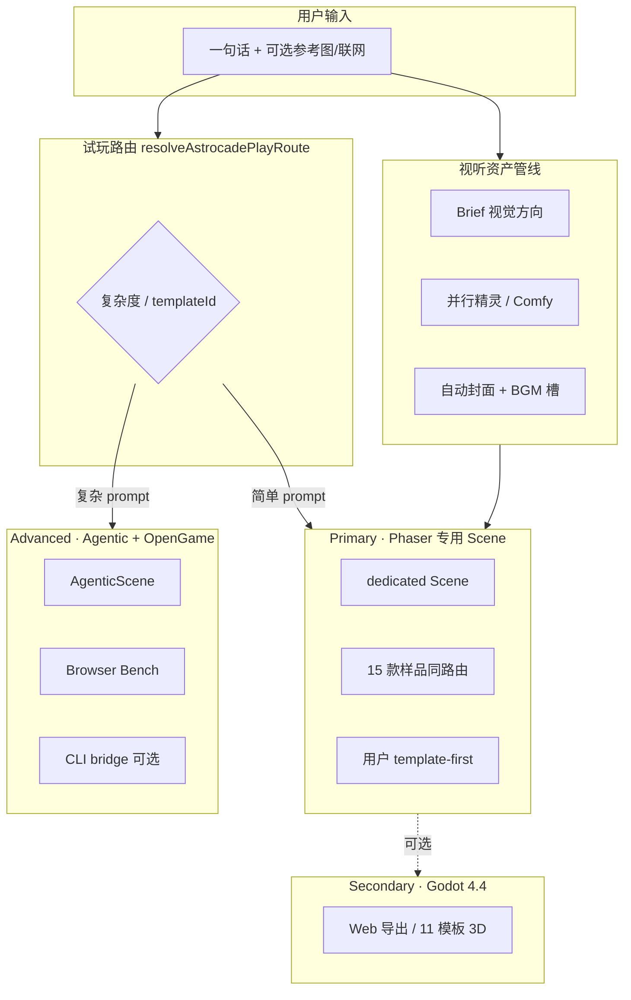
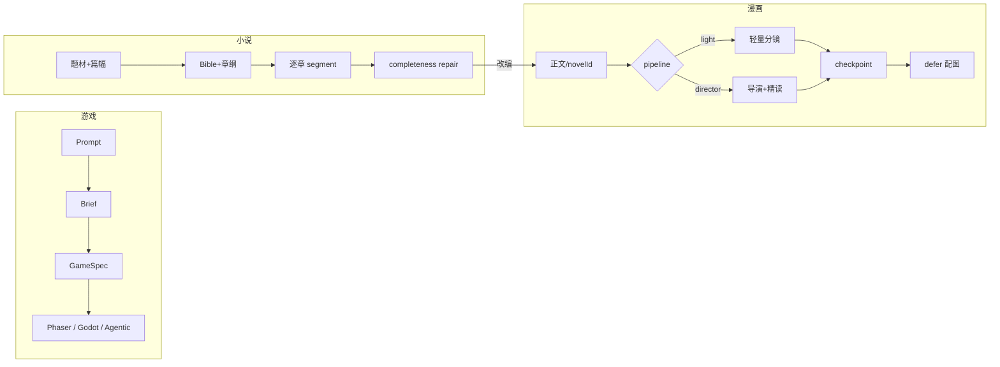
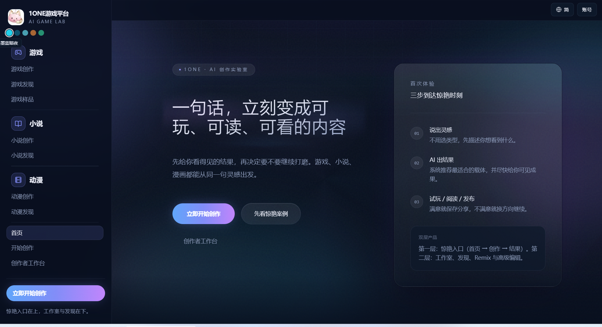
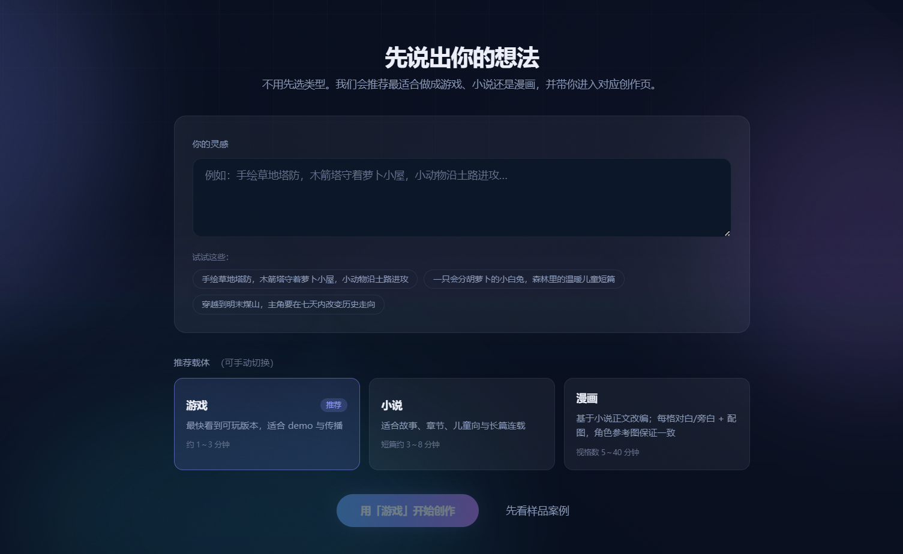
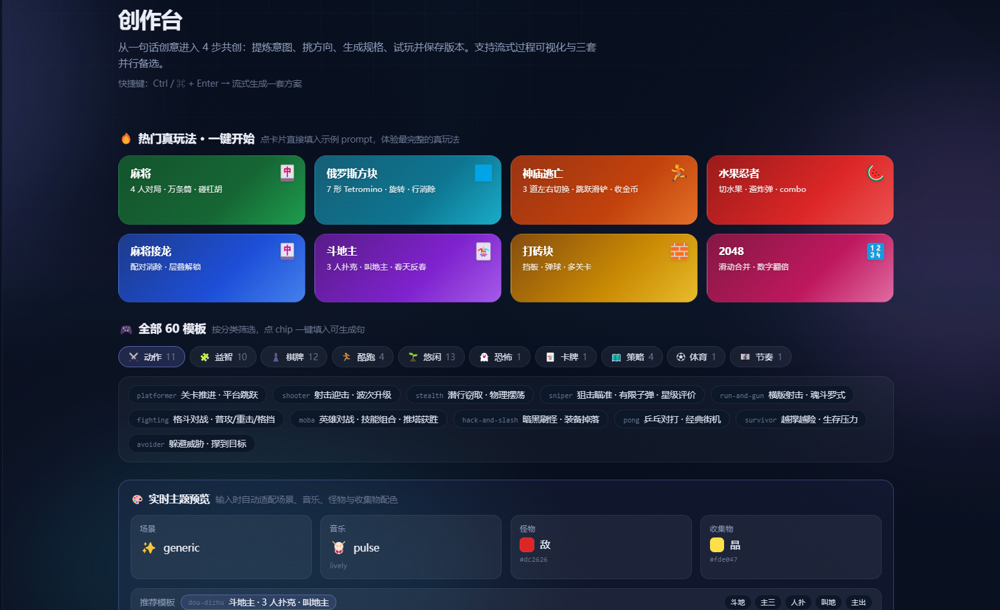
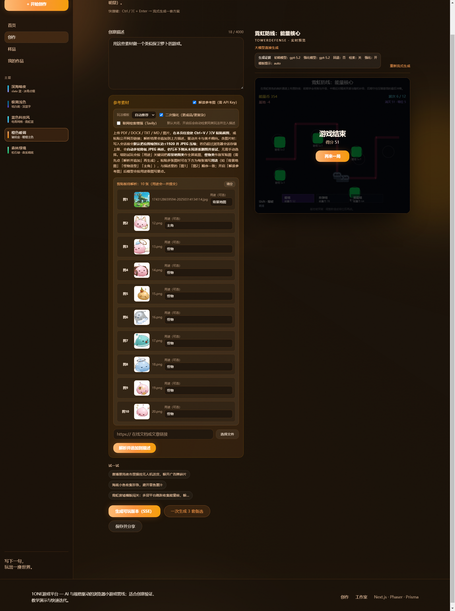
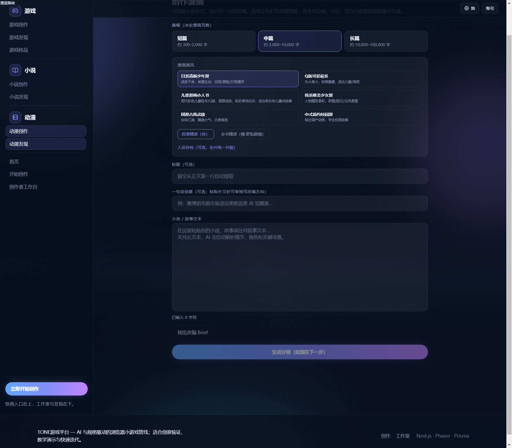
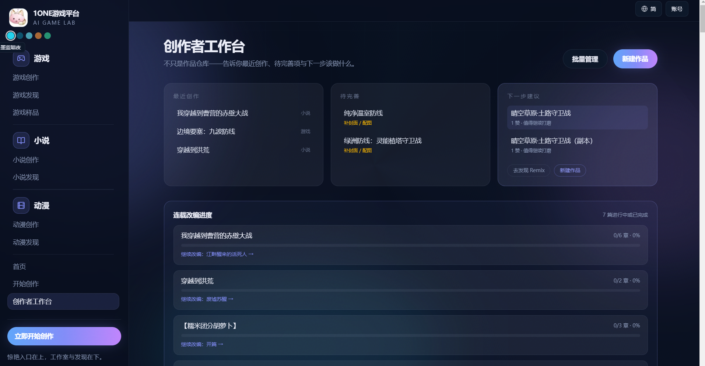
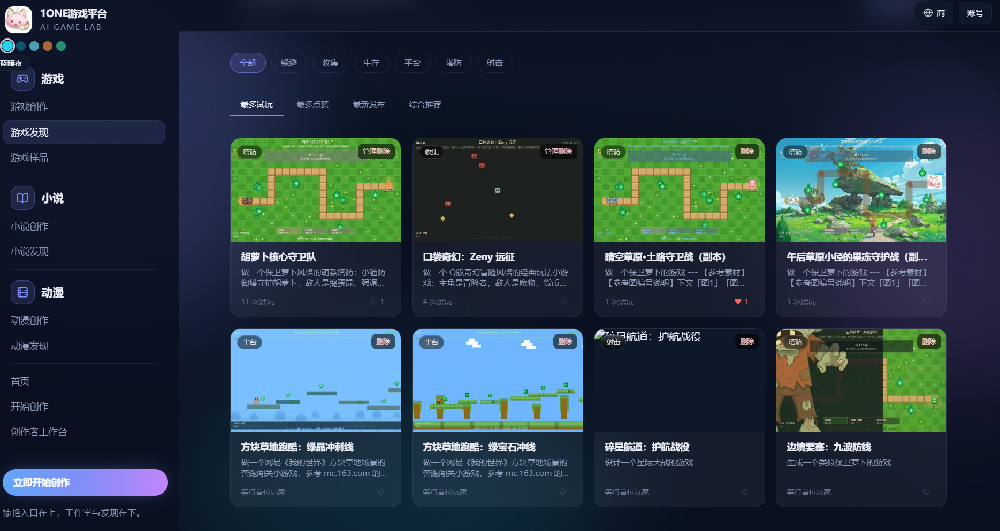
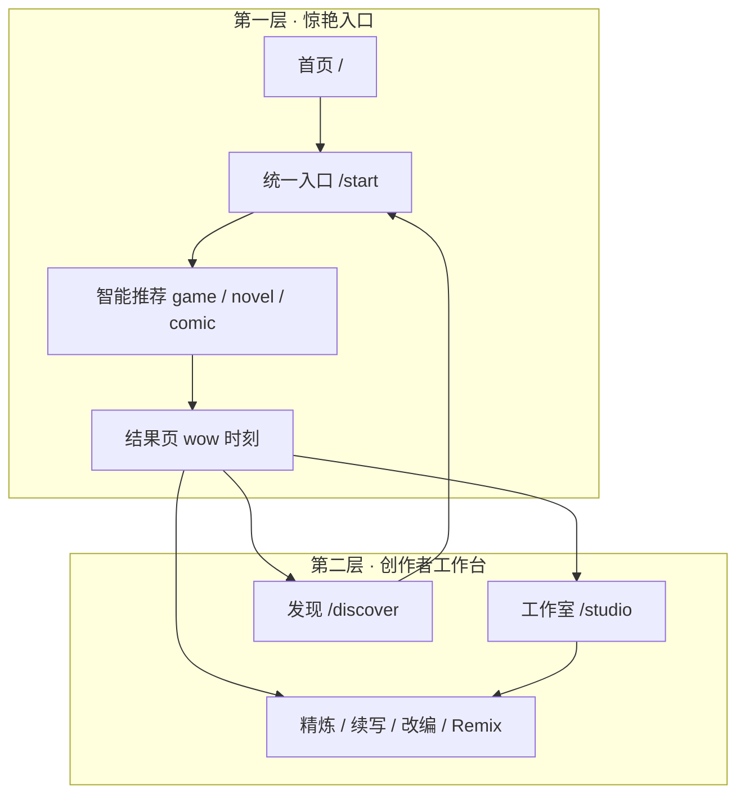

<div align="center">


# Operone 创作平台

**一句话 → 可玩游戏 · 可读小说 · 可看漫画**

AI 与规格驱动的一体化创作实验室：从灵感输入到试玩/阅读/分镜配图，再到街机 Feed、工作室管理与社区发现，全链路可在浏览器内完成。

[](https://nextjs.org/)
[](https://react.dev/)
[](https://www.prisma.io/)
[](https://phaser.io/)
[](https://godotengine.org/)

[快速开始](#快速开始) · [近期重大更新](#近期重大更新-2026-06) · [平台架构](#平台架构) · [三大创作链路](#三大创作链路) · [English](#english-overview)

</div>

---

## 目录

- [我们是谁](#我们是谁)
- [近期重大更新（2026-06）](#近期重大更新-2026-06)
- [平台架构](#平台架构)
- [三大创作链路](#三大创作链路)
- [平台能力一览](#平台能力一览)
- [产品截图](#产品截图)
- [双层产品结构](#双层产品结构)
- [架构概览](#架构概览)
- [生产部署与迁移](#生产部署与迁移)
- [多语言与国际化](#多语言与国际化)
- [功能与路由](#功能与路由)
- [技术栈](#技术栈)
- [快速开始](#快速开始)
- [模型与配置](#模型与配置)
- [环境变量](#环境变量)
- [开发与 QA](#开发与-qa)
- [项目结构](#项目结构)
- [相关文档](#相关文档)
- [English — Overview](#english-overview)

---

## 我们是谁

**Operone 创作平台**（AI GAME LAB）不是单一的「小游戏生成器」，而是一套 **游戏 + 小说 + 漫画** 共用的 AI 创作基础设施：

| 维度 | 说明 |
|------|------|
| **面向谁** | 想快速验证创意的个人创作者、教学演示、独立开发试玩、UGC 社区 |
| **交付什么** | 结构化 **GameSpec** 即时试玩、分章节小说正文、分镜 + 配图漫画 |
| **怎么做到** | Astrocade 三层运行时 + OpenGame · LLM 编排 + 规格校验 + 流式 SSE + 视听资产管线 |
| **体验原则** | **先给惊艳结果，再深度打磨** — 统一入口极简，街机 Feed / 工作室承接进阶 |

三条产品线共享：账号体系、发现广场、工作室、五语系 i18n、运行时配置后台，但各自有独立的生成管线与 QA 回归。

---

## 近期重大更新（2026-06）

### 平台架构 · Astrocade 三层运行时 + OpenGame

| 层级 | 技术 | 说明 |
|------|------|------|
| **Primary** | Phaser 4 专用 Scene | 样品馆、用户 template-first、duplicate 克隆 **同一路由**；15 款商业级样品 + 棋盘/跑酷/三消深度 polish |
| **Secondary** | Godot 4.4 Web 导出 | 11 类 3D 模板母版；Rocky/Ubuntu 使用原生 `GODOT_BIN`，**无需 Docker** |
| **Advanced** | Agentic + OpenGame Skills | 复杂 prompt 自动走 `agenticPlayRoute`；Browser Bench 沙箱校验；CLI→Agentic bridge 可选 |

| 能力 | 说明 |
|------|------|
| **OpenGame 管线** | Debug / Template / 复杂度路由 Skills；`opengame-cli` headless + 多文件 bridge；生成 recap 可观测 tier / Bench |
| **双模型路由** | 无图 `game_text` · 有参考图 `game_vision`；Console 运行时轮换，SSE 展示「模型路由」 |
| **视听资产管线** | Brief→视觉方向 → 并行精灵（Comfy 256→512）→ 自动封面 → 模板 BGM 槽（`public/game-bgm/`） |
| **商业品质底座** | `qualityTier`（minimal/standard/showcase）· HUD 目标任务卡 · 语义化 Juice · Director/Systems 可观察冲击层 |
| **Scene i18n** | 核心 Scene UI 文案五语系全覆盖（`sceneGame.*`） |

架构入口：`src/lib/astrocade-architecture.ts` · 门禁：`npm run qa:architecture-parity` · 竞品矩阵：`npm run qa:astrocade-competitor-matrix`

### 样品馆 · 15 款商业保留 + 沉浸试玩

从 23 款精简为 **15 款**可玩标杆（棋盘五款、2048、神庙跑酷、开心消消乐、农场、枪战合成等），下架薄 demo SKU；新增 **枭牌·三席残局**（斗地主样品）。

| 类别 | 代表样品 | 亮点 |
|------|----------|------|
| 棋盘 | 中国象棋 / 国际象棋 / 围棋 / 斗兽棋 | 真实线盘、将军应将、地形规则、动物图标棋子 |
| 跑酷 | 神庙遗迹 Runner · Crashy Roads | 透视跑道、金币连击、障碍波次、死亡回放摘要 |
| 益智 | 2048 · 开心消消乐 | 滑动合成、swap 三消、特殊块、冰块/道具栏 |
| 棋牌 | 斗地主（dou-dizhu） | QQ 风格 UI、SVG 圆框头像、BGM + 牌型音效 |

样品 DB 幂等同步 · 控制台「复制到样品馆」· 沉浸试玩（无全屏按钮干扰）· `qa:sample-launch-checklist` **14/14**

### 移动端 · 竖滑 Feed v2

| 入口 | 体验 |
|------|------|
| **`/arcade`** | TikTok 式竖滑全屏试玩；IntersectionObserver 懒挂载；上滑切换下一款 |
| **`/novel/feed`** · **`/comic/feed`** | 文学竖滑阅读 Feed；封面 + 摘要 + 一键进入阅读器 |
| **底栏 Dock** | `MobileBrowseDock` 统一游戏 / 小说 / 漫画 / 街机导航 |

### 社区 · 作品评论

游戏、小说、漫画详情页接入 **`WorkCommentSection`**：`GET/POST/DELETE /api/comments`，游标分页，ownerKey 鉴权删除。

### 游戏 · Agentic 生成与编排（延续）

| 改动 | 说明 |
|------|------|
| **Agentic 游戏模块** | LLM 输出可运行 JS → 沙箱 → `AgenticScene`；复杂 prompt 保留 agenticModule |
| **编排 Phase 0～4** | ContextPack、lint/repair、Comfy 探活、RunTrace |
| **封面↔试玩一致** | V2 manifest + `qa:cover-play-alignment` |
| **平台运行时配置** | super_admin `/console` 轮换网关/模型/SMTP，DB 覆盖 `.env` |

### 小说 · Planned Pipeline（延续）

| 改动 | 说明 |
|------|------|
| **逐章 segment 写作** | Bible → 章提纲 → 逐章流式 → 内置 completeness repair |
| **四档篇幅** | short / medium / long / children |
| **文学 Brief 独立** | 与游戏 Brief 分离，禁止游戏术语渗入 |

### 漫画 · 轻量/导演双流水线（延续）

| 改动 | 说明 |
|------|------|
| **Pipeline 选型** | 短篇/儿童/中篇默认页数走 light；≥12 页才 `long_director` |
| **人设图 defer** | 分镜先入库，Character Sheet 延至配图阶段 |
| **轻量分镜优化** | 2 页/批 + 四宫格 + 二分降级；中篇 8 页 ~314s |

### 运维 · Rocky 10 生产与灾备恢复

| 能力 | 说明 |
|------|------|
| **一键部署** | `install.sh` · 端口 **80** · Ubuntu / Rocky 9/10 |
| **密钥隔离** | `scripts/deploy.local.env`（gitignore）+ `prod_ssh.py` 统一 SSH |
| **迁移/恢复** | `backup-prod-for-migration.py` · `restore-prod-from-local.py` · `sync-user-sprites-to-prod.py` 断点续传 |
| **冒烟测试** | `deploy-prod-smoke-test.py` 按环境自动选择 Docker（CentOS 7 遗留）或原生 Godot |

详见 [`docs/server-migration.md`](docs/server-migration.md) · [`docs/deploy-linux-ubuntu22.md`](docs/deploy-linux-ubuntu22.md)

一键回归：`npm run qa:historical-closure` · `npm run qa:product-lines` · `npm run qa:platform-test-generate`

---

## 平台架构

Operone 对齐 **Astrocade 竞对平台架构**（非单游戏补丁），三条产品线共用账号、发现、工作室与运行时配置，游戏侧采用可演进的三层运行时：


```mermaid
flowchart TB
  subgraph Prompt [用户输入]
    P[一句话 + 可选参考图/联网]
  end

  subgraph Route [试玩路由 resolveAstrocadePlayRoute]
    R{复杂度 / templateId}
  end

  subgraph Primary [Primary · Phaser 专用 Scene]
    D[dedicated Scene]
    S[15 款样品同路由]
    U[用户 template-first]
  end

  subgraph Secondary [Secondary · Godot 4.4]
    G[Web 导出 / 11 模板 3D]
  end

  subgraph Advanced [Advanced · Agentic + OpenGame]
    A[AgenticScene]
    B[Browser Bench]
    C[CLI bridge 可选]
  end

  subgraph Sensory [视听资产管线]
    V[Brief 视觉方向]
    SP[并行精灵 / Comfy]
    CV[自动封面 + BGM 槽]
  end

  P --> Route
  R -->|简单 prompt| Primary
  R -->|复杂 prompt| Advanced
  P --> Sensory
  Sensory --> Primary
  Primary -.->|可选| Secondary
```

### 平台不变量

1. **同 template → 同 Scene**：样品、用户新建、duplicate 克隆走同一套路由规则
2. **Spec 自包含**：玩法变体写入 `GameSpec` 蓝图，运行时不再读 `sampleId` 硬编码
3. **复杂 prompt 分流**：`agenticPlayRoute` 控制 Agentic 与 dedicated 剥离/保留
4. **资产 parity**：封面 V2 manifest ↔ 试玩 preload 一致
5. **产品参数代码化**：模型、超时、篇幅阈值在 `product-config.ts`，`.env` 仅密钥与网关

深度文档：[`docs/astrocade-architecture-parity-cn.md`](docs/astrocade-architecture-parity-cn.md) · [`docs/architecture-orchestration.md`](docs/architecture-orchestration.md)

---

## 三大创作链路

### 游戏 — 4 步共创 · 三层运行时 · OpenGame 可选

```
灵感 + 参考图/联网 → Creative Brief（八维扩写）
  → 模型路由（game_text | game_vision）
  → GameSpec 草稿 → lint / repair → enrich → 视听资产管线
  → 路由：Phaser 专用 Scene | Godot Web | Agentic + OpenGame Skills
  → 保存 Project → refine / patch → Browser Bench（可选）
```

- **创作台**（`/create`）：对话式 4 方向共创、SSE 流式、参考图用途标注、Tavily 联网
- **Primary**：13+ Phaser Scene 族（collector/shooter/platformer/chess/puzzle…）；商业品质 HUD + 语义反馈
- **Advanced**：`generate-game-module.ts` → 沙箱 → `AgenticScene`；OpenGame CLI bridge 可选接入
- **视听管线**：`brief-visual-direction` → 并行精灵 → 自动封面 → 模板 BGM
- **关键文件**：`astrocade-architecture.ts` · `agentic/` · `orchestration/` · `game/engine/`

### 小说 — Bible → 章纲 → 逐章写作 → 完整性闭环

```
书名 + 题材 + 篇幅 → 文学 Brief 扩写
  → [planned] Bible → 章提纲 → 逐章 segment 流式写作
  → completeness 校验 → 内置 repair（缺章/缺结局）
  → 封面 / TTS 听书 → 长篇 segment 续写
```

| 篇幅 | 典型规模 | 管线要点 |
|------|----------|----------|
| **短篇** | ~2k 字 · 3 章 | 逐章 segment + repair |
| **中篇** | ~1.3 万字 · 5 章 | 同上，章纲驱动 |
| **长篇** | ~6 万字 · 17 章+ | outline 锁定 + 分段续写 + polish |
| **儿童** | ~500 字 · 1 章 | 温暖语言 + 后置校验 |

- **关键文件**：`src/lib/novel-planned-generate.ts` · `novel-long-generate.ts` · `novel-completeness-repair.ts` · `novel-chapters.ts`
- **QA**：`npm run qa:songliao-literary-regression`（宋辽四档 + 漫画改编）

### 漫画 — 轻量/导演双流水线 · 分镜 checkpoint · 延迟配图

```
正文或 novelId → [可选] 角色 roster
  → pipeline 选型（light | long_director）
  → 分镜 JSON（分批 + checkpoint）
  → [defer] Character Sheet → panel 文生图
  → 封面后台生成 → 发现页展示
```

| Pipeline | 适用 | 特点 |
|----------|------|------|
| **light** | 短篇/儿童/中篇默认页数 | 2 页/批、四宫格（中篇）、二分降级、无导演包 |
| **long_director** | 长篇或 ≥12 页（中篇） | 导演包 + 精读 + 蓝图 + 分块分镜 |

- **from_novel**：跳过 Brief 扩写；人设图在配图阶段按需生成
- **关键文件**：`src/lib/comic-generate-run.ts` · `comic-pipeline.ts` · `comic-generate-config.ts` · `product-config.ts`
- **QA**：`npm run qa:comic-director-pipeline` · `npm run qa:comic-storyboard-resilience`


```mermaid
flowchart LR
  subgraph Game [游戏]
    G1[Prompt] --> G2[Brief]
    G2 --> G3[GameSpec]
    G3 --> G4[Phaser / Godot / Agentic]
  end
  subgraph Novel [小说]
    N1[题材+篇幅] --> N2[Bible+章纲]
    N2 --> N3[逐章 segment]
    N3 --> N4[completeness repair]
  end
  subgraph Comic [漫画]
    C1[正文/novelId] --> C2{pipeline}
    C2 -->|light| C3[轻量分镜]
    C2 -->|director| C4[导演+精读]
    C3 --> C5[checkpoint]
    C4 --> C5
    C5 --> C6[defer 配图]
  end
  N4 -->|改编| C1
```

---

## 平台能力一览

<table>
<tr>
<td width="50%" valign="top">

**Astrocade 三层运行时**
Primary 专用 Scene + Secondary Godot + Advanced Agentic/OpenGame；样品与用户同路由 parity。

</td>
<td width="50%" valign="top">

**15 款商业样品馆**
棋盘/跑酷/三消/斗地主等可玩标杆；DB 同步、控制台复制、沉浸试玩、克隆门禁全绿。

</td>
</tr>
<tr>
<td width="50%" valign="top">

**视听资产管线**
Brief 视觉方向 → Comfy 精灵 → 自动封面 → 五槽 BGM；创作台保存时并行等待封面预览。

</td>
<td width="50%" valign="top">

**移动端竖滑 Feed**
`/arcade` 全屏试玩 Feed；小说/漫画竖滑阅读；统一底栏 Dock 跨模态导航。

</td>
</tr>
<tr>
<td width="50%" valign="top">

**4 步共创式游戏**
对话式方向推荐、SSE 流式、`game_text`/`game_vision` 双模型路由、Browser Bench 可选校验。

</td>
<td width="50%" valign="top">

**商业品质运行时**
HUD 目标任务卡、语义 Juice、Director/Systems 冲击层、`qualityTier` 分级反馈强度。

</td>
</tr>
<tr>
<td width="50%" valign="top">

**小说 planned pipeline**
Bible → 章纲 → **逐章 segment** → **内置 completeness repair**（结局、章数、字数）。

</td>
<td width="50%" valign="top">

**漫画智能 pipeline**
轻量/导演自动选型；Character Sheet defer；2 页/批 + 四宫格 + checkpoint 断点续跑。

</td>
</tr>
<tr>
<td width="50%" valign="top">

**作品评论**
游戏/小说/漫画详情页评论流；游标分页 API；owner 可删自己的评论。

</td>
<td width="50%" valign="top">

**生产运维工具链**
Rocky 10 一键部署、本地灾备恢复、精灵断点同步、`deploy.local.env` 密钥隔离。

</td>
</tr>
<tr>
<td width="50%" valign="top">

**五语系 i18n**
`zh-Hans` / `zh-Hant` / `en` / `ms` / `th` — 路由、UI、Scene 文案、API 进度消息。

</td>
<td width="50%" valign="top">

**UGC 与 Remix**
发现广场、街机 Feed、点赞/试玩统计、样品馆、短链分享 `/s/[code]`。

</td>
</tr>
<tr>
<td colspan="2" valign="top">

**自动化 QA** — B-tier 总闸（47+ 项）、OpenGame Skills、样品 launch checklist、平台生成回放、宋辽文学 E2E、Godot 导出矩阵、Playwright CI

</td>
</tr>
</table>

---

## 产品截图

> 以下均为仓库内真实界面截图（`src/png/`），可直接在 GitHub 预览。

### 首页 — 惊艳入口

<p align="center">
  
</p>

**首页**聚焦「一句话，立刻变成可玩、可读、可看的内容」。左侧导航按 **游戏 / 小说 / 动漫** 组织创作与发现；右侧 **三步到达惊艳时刻**：说出灵感 → AI 出结果 → 试玩/阅读/发布。

---

### 统一创作入口 — 智能推荐载体

<p align="center">
  
</p>

**`/start` 统一入口**：用户无需先选类型，系统根据灵感推荐 **游戏 / 小说 / 漫画** 最优载体（可手动切换）。

---

### 游戏创作台 — 4 步共创 + 双引擎

<p align="center">
  
  
</p>

**游戏创作台**（`/create`）：Godot 在线 / Phaser 双引擎、参考图、联网检索、4 步进度条与并行备选。

---

### AI 小说创作 — 类型 × 篇幅 × 流式写作

<p align="center">
  
</p>

**小说创作**（`/novel/create`）：11 种题材 + 短篇/中篇/长篇/儿童四档；文学 Brief 扩写 → 流式逐章写作 → 完整性校验。

---

### AI 漫画创作 — 画风 × 精读模式 × 人设一致

<p align="center">
  
</p>

**漫画创作**（`/comic/create`）：6 种画风、段落/全书精读、人设存档；轻量 pipeline 默认先分镜入库，配图异步补全。

---

### 创作者工作台 · 发现广场 · 样品馆

<p align="center">
  
  
</p>

**`/studio`** 追踪待完善项与小说→漫画改编进度；**发现页** 支持 Remix；**`/samples`** 样品馆试玩 + 克隆。

---

## 双层产品结构


```mermaid
flowchart TD
  subgraph Layer1 [第一层 · 惊艳入口]
    H[首页 /] --> S[统一入口 /start]
    S --> M[智能推荐 game / novel / comic]
    M --> R[结果页 wow 时刻]
  end
  subgraph Layer2 [第二层 · 创作者工作台]
    R --> ST[工作室 /studio]
    R --> D[发现 /discover]
    R --> ADV[精炼 / 续写 / 改编 / Remix]
    ST --> ADV
    D --> S
  end
```

| 层级 | 目标 | 代表页面 |
|------|------|----------|
| **第一层** | 30 秒内看到成果 | `/` · `/start` · `/arcade` · `/play` · `/novel/[id]` |
| **第二层** | 长期创作与运营 | `/studio` · `/discover` · `/console` · `/admin` |

---

## 架构概览

```mermaid
flowchart TB
  subgraph Client [浏览器 · Next.js App Router]
    UI[React 19 + next-intl]
    Create[共创 SSE 客户端]
    Mobile[街机/文学竖滑 Feed]
    Run[Phaser · Godot Web · AgenticScene]
  end

  subgraph API [Route Handlers]
    Gen[游戏 generate / stream / refine / agentic]
    Novel[小说 generate / stream / continue]
    Comic[漫画 generate / panels / stream]
    Arcade[/api/arcade/feed]
    Comments[/api/comments]
    Admin[console · admin]
  end

  subgraph Core [领域核心 lib]
    Astro[astrocade-architecture]
    Spec[GameSpec + orchestration]
    OG[OpenGame Skills · CLI bridge]
    Agent[agentic 沙箱]
    Sensory[精灵/封面/BGM 管线]
    NPipe[novel-planned · repair]
    CPipe[comic light/director]
  end

  subgraph External [外部能力]
    LLM[OpenAI 兼容网关]
    IMG[gpt-image / Gemini / Comfy]
    DB[(Prisma + SQLite)]
  end

  UI --> API
  Create --> API
  Mobile --> API
  Run --> API
  API --> Core
  Core --> LLM
  Core --> IMG
  API --> DB
```

### 数据模型（节选）

| 模型 | 用途 |
|------|------|
| `Project` | 游戏 specJson、封面、试玩/点赞、Agentic 模块、`agenticPlayRoute` |
| `Novel` | 正文、篇幅档、summary、characterRosterJson |
| `Comic` | 分镜 JSON、配图 URL、关联 novelId、draft checkpoint |
| `Comment` | 作品评论（game/novel/comic），游标分页 |
| `PlatformRuntimeConfig` | 网关/模型/SMTP 加密配置（DB 覆盖 `.env`） |
| `User` | 邮箱/OAuth、角色、额度 |

Schema：`prisma/schema.prisma` · 迁移：`prisma/migrations/`。

---

## 多语言与国际化

| Locale | 语言 |
|--------|------|
| `zh-Hans` | 简体中文（默认） |
| `zh-Hant` | 繁体中文 |
| `en` | English |
| `ms` | Bahasa Melayu |
| `th` | ไทย |

- **路由**：`/[locale]/...` · 消息：`src/messages/*.json` · Scene：`sceneGame.*`
- **API 进度**：`progressNovelMessage` / `progressComicMessage` 按 locale 返回
- **QA**：`npm run qa:multilingual-locale` · `npm run qa:novel-locale`

---

## 功能与路由

| 路径 | 说明 |
|------|------|
| `/` · `/start` | 首页 · 统一创作入口 |
| `/create` | 游戏 4 步共创台 |
| `/arcade` | **移动端竖滑街机 Feed**（全屏沉浸试玩） |
| `/novel/create` · `/novel/feed` | 小说创作 · **竖滑阅读 Feed** |
| `/comic/create` · `/comic/feed` | 漫画创作 · **竖滑阅读 Feed** |
| `/studio` | 创作者工作台 + 改编进度 |
| `/discover` · `/games` · `/novels` · `/comics` | 发现与列表 |
| `/play/[id]` | 游戏试玩 + refine + **评论** |
| `/novel/[id]` | 阅读器 + 听书 + 改编漫画 + **评论** |
| `/comic/[id]` | 分镜阅读 + 批量配图 + **评论** |
| `/samples` | 样品馆（15 款商业标杆） |
| `/console` | super_admin 运行时配置 |
| `/login` · `/billing` · `/admin` | 登录 · 商业化 · 管理（含样品馆运维） |

---

## 技术栈

| 层 | 选型 |
|----|------|
| 框架 | Next.js 16 App Router · React 19 · TypeScript |
| i18n | next-intl（五语系，含 Scene UI） |
| 数据库 | Prisma 5 · SQLite（可换 PostgreSQL） |
| 游戏 | Phaser 4 专用 Scene · Godot 4.4 Web · Agentic + OpenGame |
| AI | OpenAI 兼容 SDK · `game_text`/`game_vision` 双路由 · Comfy 精灵 |
| 测试 | Playwright E2E · tsx QA（B-tier 47+ 项）· GitHub Actions |
| 部署 | Linux 一键（**80**）· Rocky/Ubuntu · `deploy.local.env` 密钥隔离 |

---

## 快速开始

**环境**：Node.js **18+**（推荐 **22**）、npm。

```bash
npm ci
copy .env.example .env          # Windows；macOS/Linux: cp .env.example .env
npx prisma migrate dev
npm run dev
```

浏览器打开 **http://localhost:8888**。

未配置 `OPENAI_API_KEY` 时，部分链路走 mock / 规则推断（以运行时提示为准）。

**局域网多端**：`.env.local` 设置 `NEXT_PUBLIC_DEV_CANONICAL_ORIGIN=http://你的局域网IP:8888`。

---

## 生产部署与迁移

### 新机一键安装

推荐 **Ubuntu 22.04** 或 **Rocky 9/10**（优于 CentOS 7，原生 Godot 无需 Docker）：

```bash
curl -fsSL https://raw.githubusercontent.com/gaogg521/1one-game/main/scripts/deploy/install.sh | bash
```

| 项 | 默认值 |
|----|--------|
| 安装目录 | `/opt/operone` |
| 监听端口 | **80** |
| Godot 导出 | 原生 `GODOT_BIN` + 导出模板（Rocky/Ubuntu） |
| 再次执行 | 自动 `git pull` 更新 |

**域名 + HTTPS**（可选，需 Nginx + Certbot）：

```bash
export OPERONE_DOMAIN='app.example.com'
export CERTBOT_EMAIL='ops@example.com'
sudo bash /opt/operone/scripts/deploy/linux-ubuntu22-full.sh --nginx-only
sudo bash /opt/operone/scripts/deploy/linux-ubuntu22-full.sh --ssl-only
```

> **说明**：`install-docker.sh` 为整站 Docker 部署可选方案；**Godot 导出**在 CentOS 7 遗留环境才需要 `GODOT_USE_DOCKER=1`，Rocky/Ubuntu 不必装 Docker。

### 本机运维脚本（密钥不进 Git）

复制 `scripts/deploy.local.env.example` → `scripts/deploy.local.env`，填入 SSH 主机与密码/密钥后：

| 脚本 | 用途 |
|------|------|
| `deploy-prod-with-assets.py` | 代码部署 + 样品资源同步（**日常发布**） |
| `deploy-prod-smoke-test.py` | 生产冒烟（API + 原生 Godot / Docker 自适应） |
| `restore-prod-from-local.py` | 从本机 `dev.db` + 资源恢复生产 |
| `sync-user-sprites-to-prod.py` | 用户精灵目录断点续传 |
| `backup-prod-for-migration.py` | 打包 `.env` + `prod.db` + 封面/精灵 |
| `after-rocky10-reinstall.py` | Rocky 重装后恢复编排入口 |

完整迁移手册：**[`docs/server-migration.md`](docs/server-migration.md)** · 安装细节：**[`docs/deploy-linux-ubuntu22.md`](docs/deploy-linux-ubuntu22.md)**

| 部署脚本 | 说明 |
|----------|------|
| [`scripts/deploy/install.sh`](scripts/deploy/install.sh) | `curl \| bash` 入口 |
| [`scripts/deploy/linux-ubuntu22-full.sh`](scripts/deploy/linux-ubuntu22-full.sh) | 完整安装 / `--nginx-only` / `--ssl-only` |
| [`scripts/prod_ssh.py`](scripts/prod_ssh.py) | 所有 Python 运维脚本的 SSH 配置中心 |

---

## 模型与配置

**产品参数不在 `.env`**，统一见 **`src/lib/product-config.ts`**。

| 能力 | 默认主模型 | 备注 |
|------|------------|------|
| 游戏（纯文本） | `glm-5-2` | `game_text` 路由 · Console 可配 |
| 游戏（含参考图） | `gpt-5-4` | `game_vision` 多模态路由 |
| 小说 / 漫画 JSON | `deepseek-v4-pro` | 文学/分镜 JSON |
| 封面 / 分镜配图 | `gpt-image-2` | 1024×1024；精灵可走 Comfy |

| 漫画 pipeline 阈值 | 值 | 说明 |
|--------------------|-----|------|
| `mediumDirectorMinPages` | 12 | 中篇 ≥12 页才走导演流水线 |
| `directorPipelineMinPages` | 6 | 长篇或未指定 tier 的页数阈值 |
| `charSheetTimeoutMs` | 180s | 单角色参考图超时 |
| `storyboardChunkPages` | 4（中篇/短篇轻量 2） | 分镜批大小 |

| 链路 | 关键文件 |
|------|----------|
| 产品常量 | `src/lib/product-config.ts` |
| 平台路由 | `src/lib/astrocade-architecture.ts` · `astrocade-play-spec.ts` |
| OpenGame | `src/lib/opengame-skills/` · `opengame-cli.ts` · `browser-bench.ts` |
| 游戏规格 | `src/lib/generate-spec.ts` · `src/lib/agentic/` |
| 视听管线 | `src/lib/brief-visual-direction.ts` · `runProjectAssetPipeline` |
| 小说 planned | `src/lib/novel-planned-generate.ts` · `novel-completeness-repair.ts` |
| 漫画运行 | `src/lib/comic-generate-run.ts` · `comic-pipeline.ts` |
| 编排 | `src/lib/orchestration/` |

---

## 环境变量

复制 **`.env.example`** → **`.env`**。常用项：

| 变量 | 说明 |
|------|------|
| `DATABASE_URL` | 默认 `file:./dev.db` |
| `OPENAI_API_KEY` | 网关密钥（真实 LLM/文生图必填） |
| `OPENAI_BASE_URL` | LiteLLM / 兼容网关根地址 |
| `EMAIL_AUTH_DEV_EXPOSE` | 开发环境返回注册验证码 |
| `SUPER_ADMIN_SECRET` | 升权 super_admin / 运行时配置加密 |

完整列表见 `.env.example`。上线后 super_admin 可在 **`/console`** 轮换网关与模型（DB 优先生效）。

---

## 开发与 QA

### 常用命令

| 命令 | 说明 |
|------|------|
| `npm run dev` | 开发服务 **8888** |
| `npm run build` | 生产构建 |
| `npm run test:e2e` | Playwright（CI 用 `PW_START=1`） |
| `npm run qa:full` | 全量 QA |
| `npm run qa:historical-closure` | 历史问题总验（~90s） |

### 三大产品线 QA

| 命令 | 说明 |
|------|------|
| `npm run qa:product-lines` | 游戏 + 小说 + 漫画 分线总验 |
| `npm run qa:b-tier-smoke` | B-tier 总闸（47+ 契约项） |
| `npm run qa:platform-test-generate` | 平台用户路径：简单 dedicated + 复杂 Agentic |
| `npm run qa:platform-create-replay` | 创作台回放验收 |
| `npm run qa:songliao-literary-regression` | 宋辽四档小说 + 漫画改编 E2E |
| `npm run qa:sample-launch-checklist` | 样品上架清单（封面/精灵/parity/hook） |
| `npm run qa:opengame-skills` | OpenGame Skills + 复杂度路由 |
| `npm run qa:opengame-browser-bench` | Agentic 浏览器沙箱 Bench |
| `npm run qa:architecture-parity` | Astrocade 三层运行时不变量 |
| `npm run qa:multilingual-locale` | 五语系回归 |
| `npm run qa:godot-export:matrix` | Godot 模板 Web 导出 |
| `npm run qa:cover-play-alignment` | 封面↔试玩资产一致 |

### 宋辽文学 E2E 示例

```powershell
# 仅小说四档
$env:QA_SKIP_COMIC="1"
npm run qa:songliao-literary-regression

# 中篇 8 页漫画（跳配图，~5min）
$env:QA_COMIC_NOVEL_ID="<已有中篇 novelId>"
$env:QA_COMIC_PAGES="8"
$env:SKIP_COMIC_PANELS="1"
npm run qa:songliao-literary-regression
```

**CI**（`.github/workflows/ci.yml`）：lint + 编排冒烟 + 多语回归 + E2E。

测试库：**`prisma/ci.sqlite`**（无密钥）。

---

## 项目结构

```text
game/
├── prisma/                 # schema + migrations
├── public/
│   ├── brand/              # Logo
│   ├── samples/            # 样品馆实机截图封面（15 款）
│   ├── game-sprites/       # 用户/样品精灵（运行时，勿整包提交）
│   ├── game-bgm/           # 模板 BGM 槽（.ogg）
│   └── covers/             # 用户封面（运行时生成）
├── src/
│   ├── app/                # 页面与 API（含 /arcade、/api/comments）
│   ├── components/         # UI、GamePlayer、Mobile Feed、WorkComment…
│   ├── game/engine/        # Phaser Scene + HudGoalPanel + AgenticScene
│   ├── lib/
│   │   ├── astrocade-architecture.ts  # 三层运行时路由
│   │   ├── agentic/        # Agentic 游戏模块
│   │   ├── opengame-skills/ # OpenGame Skills 与 Browser Bench
│   │   ├── novel-*/        # 小说 planned / long / completeness
│   │   ├── comic-*/        # 漫画 pipeline / 分镜 / 配图
│   │   └── product-config.ts
│   └── messages/           # 五语系 JSON（含 sceneGame）
├── scripts/                # QA + 生产运维（prod_ssh.py、sync-*-to-prod.py）
├── godot-templates/        # Godot 母版
├── e2e/                    # Playwright（含 platform-smoke）
├── docs/                   # 架构、部署、迁移文档
└── PROJECT_MEMORY/         # 迭代记忆与 NEXT_ACTION
```

> **注意**：`public/game-sprites/`、`public/covers/` 下大量运行时生成图片体积可达数 GB，不适合直接 `git push`；本地保留即可，或使用 Git LFS / 对象存储。

---

## 相关文档

| 文档 | 说明 |
|------|------|
| [`docs/astrocade-architecture-parity-cn.md`](docs/astrocade-architecture-parity-cn.md) | Astrocade 三层运行时与平台不变量 |
| [`docs/ai-handoff-architecture-cn.md`](docs/ai-handoff-architecture-cn.md) | 给其他 AI：架构总览 + 源码索引 |
| [`docs/architecture-orchestration.md`](docs/architecture-orchestration.md) | 编排 Phase 0～4 |
| [`docs/deploy-linux-ubuntu22.md`](docs/deploy-linux-ubuntu22.md) | Linux 生产一键部署 |
| [`docs/server-migration.md`](docs/server-migration.md) | **服务器迁移 / Rocky 重装 / 灾备恢复** |
| [`docs/local-database.md`](docs/local-database.md) | 本地库与迁移 |
| [`docs/admin-super-admin.md`](docs/admin-super-admin.md) | 超级管理员与 `/console` |
| [`PROJECT_MEMORY/NEXT_ACTION.md`](PROJECT_MEMORY/NEXT_ACTION.md) | 当前迭代与验证命令 |
| [`CLAUDE.md`](CLAUDE.md) | 永续研发总则 |

---

<a id="english-overview"></a>

## English — Overview

**Operone Creation Platform** turns one sentence into **playable games**, **readable novels**, and **visual comics** — in the browser, with AI orchestration end to end.

### Architecture (June 2026)

- **Three-tier game runtime** (Astrocade-aligned): Primary Phaser dedicated Scenes · Secondary Godot 4.4 Web · Advanced Agentic + OpenGame Skills with optional Browser Bench.
- **15 curated sample games** with commercial-grade polish (board games, temple runner, match-3, dou dizhu, etc.).
- **Sensory asset pipeline**: Brief visual direction → parallel sprites (Comfy) → auto cover → template BGM slots.
- **Mobile Feed v2**: `/arcade` vertical swipe play · novel/comic literary feeds · unified bottom dock.
- **Work comments** on games, novels, and comics.
- **Production ops**: Rocky 10 one-click deploy on port 80 · `deploy.local.env` secret isolation · disaster recovery scripts.

### Literary pipelines (unchanged highlights)

- **Novels**: bible → chapter plan → per-chapter segments → built-in completeness repair.
- **Comics**: light vs director auto-routing · deferred character sheets · 2 pages/batch bisection fallback.

### Quick start

```bash
npm ci && cp .env.example .env && npx prisma migrate dev && npm run dev
# → http://localhost:8888
```

Product models and pipeline thresholds: **`src/lib/product-config.ts`**. Secrets only in **`.env`** or **`/console`** runtime config.

**Production:**

```bash
curl -fsSL https://raw.githubusercontent.com/gaogg521/1one-game/main/scripts/deploy/install.sh | bash
# → http://<server-ip>/ · see docs/server-migration.md
```

See [`docs/astrocade-architecture-parity-cn.md`](docs/astrocade-architecture-parity-cn.md) for the platform architecture guide.

---

<div align="center">

**Operone 创作平台** · 让一句话变成可玩、可读、可看的内容

*One prompt · playable · readable · visual*

</div>
