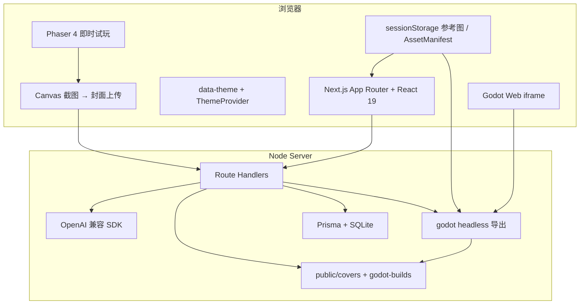
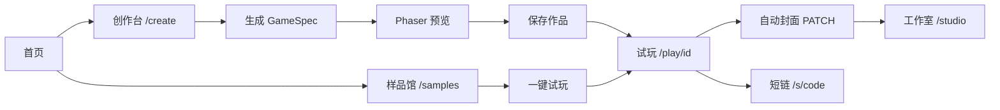

# AI / 协作者接手稿：进展摘要与当前架构

> **用途**：发给另一位 AI 或新成员快速对齐——项目是什么、文档在哪、架构怎么分层、最近改了什么、接手续写什么。  
> **仓库根**：`D:\game`（或你的克隆路径）。实现以当前分支代码为准。

---

## 1. 项目一句话

**1ONE 游戏平台**：用户自然语言描述玩法 → **大模型产出 `GameSpec`（JSON）** → **`enrichGameSpecForRuntime` 补全导演/蓝图** → 浏览器 **Phaser 4** 即时试玩（或 **Godot Web** 完整版）→ 保存 / 工作室 / 短链分享。

- **前端**：Next.js App Router、React 19、`data-theme` 全站主题。  
- **后端**：Route Handlers、Prisma + **SQLite**、`Project.specJson` 存规格。  
- **模型**：OpenAI 兼容 SDK（`OPENAI_BASE_URL` 可接 LiteLLM / 网关）。

---

## 2. 知识库与文档（阅读顺序）

| 优先级 | 文件 | 内容 |
|--------|------|------|
| 1 | [`README.md`](../README.md) | 产品能力、路由表、环境变量、API、开发命令、CI、参考图策略；含英文概览 |
| 2 | **本文** | 接手总览 + **当前架构** + 源码索引 |
| 3 | [`recent-progress.md`](recent-progress.md) | 近期功能迭代细节（一致性、音频、参考图、并行、塔防稳健性等） |
| 4 | [`architecture-orchestration.md`](architecture-orchestration.md) | 编排 Phase 0～4、RunTrace、Comfy、并行说明、冒烟与 CI |
| 5 | [`../ai_game_generation_platform_architecture_cn.md`](../ai_game_generation_platform_architecture_cn.md) | **中长期愿景**（多 Agent、资产协议、DSL Runtime）；**≠ 当前仓库实现**，对照用 |
| 5b | [`godot-quickstart-cn.md`](godot-quickstart-cn.md) | **Godot 速成**、GameSpec 映射、多 Agent 契约；母版 `godot-templates/ai-mother-universal/`（与 Phaser 双轨） |
| 6 | [`../AGENTS.md`](../AGENTS.md) | Next.js 与本训练数据可能不一致，改框架相关代码前先查官方文档 |
| 7 | [`.env.example`](../.env.example) | 环境变量注释 |

---

## 3. 当前整体架构（运行时）

逻辑上分为 **浏览器** 与 **Node 服务端**，规格与作品数据走 API + 本地 DB/文件。



### 3.1 核心用户路径



### 3.2 生成流水线（服务端，概念层）

当前是 **规格驱动**：以 `GameSpec` 为单一真相，**不是**文档愿景里那种多 Agent 并行产 3D/骨骼资产。

```text
用户 Prompt（+ 可选参考摘要 / 联网块 / assetManifest）
    → creative_brief_expand（题材知识包 + 可选 LLM → Creative Brief 八维扩写）
    → ContextPack（编排 trace 记 context_pack）
    → [可选] tryWebEnhance（Tavily + 并行抓取 URL 正文）
    → spec_draft：LLM json_schema → GameSpec 初稿（或 mock）
    → [可选] spec_enhance：二次强化 LLM
    → finish：lintGameSpecForOrchestration + 多轮 repair
    → finalizeSpec（塔防蓝图 / director / systems / presentation 默认）
    → [可选] scheduleGodotPrefetch + trace 步 godot_web_prefetch
    → 返回 spec（SSE 最后一帧带完整 spec + orchestrationTrace）
```

**并行优化（已实现）**：

- 联网：多 URL **`fetchUrlPlainText`** 用 **`Promise.all`**。  
- **Rich 编排**：存在 **`RunTraceRecorder`** 且 **`ORCHESTRATION_QUALITY_TIER=rich`** 时，**Comfy 探活**与 **初稿 draft** **`Promise.all`**，再写 `comfy_probe` note。

详见 [`architecture-orchestration.md`](architecture-orchestration.md)。

### 3.3 编排 Phase 快照（落地范围）

| Phase | 含义（极短） |
|-------|----------------|
| 0 | ContextPack、RunTrace、并行 I/O、comfy 与 draft 并行（rich） |
| 1 | `lintGameSpecForOrchestration`、返回前 lint-repair 闭环 |
| 2 | AssetManifestV1（参考图条目元数据，不写像素） |
| 3 | Comfy URL 探测、`/api/orchestration/comfy-status`、trace `comfy_probe` |
| 4 | `qa:orch-smoke`、Playwright E2E、GitHub Actions CI |

### 3.4 运行时与一致性（浏览器内）

- **`createPhaserGame`**：根据 `templateId` 挂载 `PlayScene` / `PlatformerScene` / `TowerDefenseScene`。  
- **`cohesive-presentation`**：由 `theme`（及可选 `presentation.musicProfile`）推导 **HUD / 横幅 / 塔防 UI / 平台砖色**，并映射试玩外壳 **CSS 变量**（`GamePlayerInner`）。  
- **音频**：`GameSoundscape` 程序化铺底 + `webBleeps` 蜂鸣；共用 `audio-context`；首次 `pointerdown` 启动；尊重 `prefers-reduced-motion`。  
- **参考图**：会话内像素管线保留 Alpha、贴片类方格 contain（见 `recent-progress.md`）。

#### 3.4.1 视觉渲染层（2026-05 全面升级）

**PlayScene**（avoider / collector / survivor）：玩家/敌人/收集物从纯色几何块升级为程序化卡通角色（圆角身体、眼睛、表情、高光），道具改为五角星形。

**TowerDefenseScene** 视觉管线：

| 子系统 | 升级内容 |
|--------|---------|
| `drawGridMap()` | 从深色格子地图升级为「保卫萝卜」风格：明亮双色草地 + 彩色花草装饰 + 沙色 3D 石板路（高光/阴影/裂纹） + 路径投影 |
| 建造指示器 | 从灰色圆角矩形改为绿色圆形底座 + 向上箭头指示针（PvZ 风格） |
| `ensureTowerTextureForId()` | 三种炮塔各有独立卡通角色设计（植物系/火焰系/冰晶系），48×52，含眼睛、表情、专属顶部装饰 |
| 敌人染色 | 移除 update 循环中 `setTint(hazardColor)` 强制染色，仅减速状态染蓝，正常状态 `clearTint()` |
| 终点守护目标 | 无参考图时程序化绘制：萝卜形 / 冰晶形 / 通用盾形，带发光圆环与名称标签 |

**路径与塔位（`td-blueprint.ts`）**：
- **4 种路径模板**（Z / 双 U / 宽螺旋 / 波浪），由 `hashString(prompt+title) % 4` 选取
- **塔位最小间距**：每段路径两侧各取候选点，按相对距离 ≥ 0.13 过滤，均匀覆盖全路径

**PlatformerScene**（`addStarfield()`）：识别标题/副标题关键词，自动选择主题背景（太空/海洋/森林/赛博/通用）。

---

## 4. 主要路由与 API（摘要）

更全的表见 [`README.md`](../README.md)。

**页面**：`/`、`/create`、`/studio`、`/samples`、`/play/[id]`、`/s/[code]`。

**API（节选）**：`POST /api/generate`、`/api/generate/stream`（SSE）、`/api/generate/variants`、`POST /api/ingest`、`/api/projects*`、`GET /api/health`、`GET /api/orchestration/comfy-status`。

---

## 5. 近期进展要点（详见 recent-progress）

- **2026-05 视觉大升级**：全模板程序化贴图重写；塔防地图升级为保卫萝卜风格（石板路 + 草地装饰 + 绿色建造针）；三类炮塔卡通角色化；敌人恢复真实颜色；路径 4 种模板多样化；塔位均匀分布；平台跳跃主题背景。
- **GameSpec**：`presentation.musicProfile`（`organic` \| `pulse` \| `minimal` \| `neon`）；`withPresentationDefaults` 补缺。  
- **视觉/试听一致**：`cohesive-presentation.ts` + Phaser 三场景 HUD + `HudBanner` + 塔防选择条 + `GamePlayerInner` 外壳变量。  
- **生成性能**：联网多页并行抓取；rich 下 Comfy 与初稿并行。  
- **塔防**：bootstrap/shutdown、纹理回退、路径模板、塔位间距、终点守护目标常显。  
- **工程**：`createPhaserGame.ts` 须保持函数括号闭合，避免 Turbopack `Expected '}', got '<eof>'`。

---

## 6. 核心源码索引

| 领域 | 路径 |
|------|------|
| 生成与修复 | `src/lib/generate-spec.ts` |
| Spec / 归一化 | `src/lib/game-spec.ts`、`src/lib/normalize-spec.ts` |
| 一致性推导 | `src/lib/cohesive-presentation.ts` |
| 编排 trace / lint | `src/lib/orchestration/run-trace.ts`、`lint-spec.ts`、`index.ts` |
| Asset 清单 | `src/lib/orchestration/asset-manifest.ts` |
| **塔防路径与塔位** | **`src/lib/td-blueprint.ts`**（4 种路径模板、间距过滤） |
| **Godot 导出** | **`src/lib/godot-export.ts`**、`POST /api/godot/export`（可带 `referencePayloads`）、`prefetchGodotExport` 后台预构建、`GameRuntimeTabs` |
| **双轨品质** | `enrichGameSpecForRuntime`、`gameJuice.ts` / `game_juice.gd`、`GameAudio`、`RuntimeReferenceRegistry` |
| **参考图分类** | `src/lib/reference-classify.ts`（Phaser / Godot 共用） |
| **Godot 预导出** | `godot-prefetch-scheduler.ts`、`godot-prefetch.client.ts`、`studio-godot-prefetch.client.ts` |
| **Godot E2E** | `e2e/godot-runtime.smoke.spec.ts`、`e2e/godot-templates-matrix.spec.ts`；CI job `godot-export` |
| **Godot CI 安装** | `scripts/godot-install-ci.sh`、`qa:godot-export:matrix` |
| Godot 母版 | `godot-templates/ai-mother-universal/`（全模板；`game-runtime-preference.ts` 全局引擎偏好） |
| Phaser 工厂 | `src/game/engine/createPhaserGame.ts` |
| **PlayScene 贴图** | **`src/game/engine/PlayScene.ts`**（卡通玩家/敌人/收集物） |
| **塔防场景（地图/炮塔/敌人）** | **`src/game/engine/TowerDefenseScene.ts`**（`drawGridMap`、`ensureTowerTextureForId`、守护目标、建造针） |
| **平台跳跃背景** | **`src/game/engine/PlatformerScene.ts`**（`addStarfield` 主题背景） |
| 横幅 | `src/game/engine/HudBanner.ts` |
| 音频 | `src/game/audio/gameSoundscape.ts`、`audio-context.ts`、`webBleeps.ts` |
| 试玩组件 | `src/components/GamePlayerInner.tsx`、`GamePlayer.tsx` |
| 调试面板 | `src/components/SpecQuickTunePanel.tsx` |
| 参考图客户端 | `src/lib/assets/reference-image-payloads.client.ts` |
| SSE 生成 | `src/app/api/generate/stream/route.ts` |

---

## 7. 协作约束（给 AI）

- 改 **GameSpec 形状**时同步：**Zod、`coerceGameSpec`、`generate-spec` 的 SYSTEM/JSON_SCHEMA（若适用）**、必要时 **lint / 冒烟 / E2E**。  
- **少做与需求无关的重构**；对齐现有命名与目录习惯。  
- **Next.js**：以本仓库安装的 `next` 版本与 `node_modules/next/dist/docs/` 为准（`AGENTS.md` 有提醒）。  
- 生产封面写本地 `public/covers`：**多实例 / Serverless** 需改为对象存储（README 已说明）。

---

## 8. 愿景 vs 现状

[`ai_game_generation_platform_architecture_cn.md`](../ai_game_generation_platform_architecture_cn.md) 描述 **多 Agent、统一资产协议、DSL、QA 自动修 Bug、秒级重型 Runtime** 等。  
**当前仓库**是轻量落地：**一句话 → GameSpec → Phaser 2D 模板**。若要做「真·多 Agent」，需在服务端增加 **任务 DAG、合并层、额外模型调用与成本策略**，而非仅加文档。

### 8.1 Godot 深度路线（与产品方对齐）

**共识**：Godot 是「全能跨平台引擎」（编辑器 + 2D/3D），在本平台不是 Phaser 的弱化副本，而是 **可进编辑器、可导出、可扩展的专业轨**。

| 阶段 | 状态 | 内容 |
|------|------|------|
| A | 已落地 | GameSpec → headless Web 导出；六模板 `*_runtime.gd`；双轨手感/音频/参考图/导演 |
| B | 已落地 | 全入口预取；CI `godot-export` 六模板矩阵；E2E Godot 标签 |
| C | 进行中 | 文档与母版对齐 4.4.1；Linux/Windows 安装脚本统一 |
| D | 规划 | 桌面/移动 export preset；「下载 Godot 工程」；官方 demo 反哺母版 |
| E | 规划 | 3D `templateId` + 新母版（不推翻现有 2D JSON） |

Phaser 继续承担 **秒开预览**；Godot 承担 **更接近成品的运行时与工程资产**。详见 [`godot-quickstart-cn.md`](godot-quickstart-cn.md) 开篇「产品定位」。

---

## 9. 常用命令

```bash
npm ci
npx prisma migrate dev
npm run dev          # 默认 http://localhost:8888
npm run lint
npm run qa:orch-smoke
npm run test:e2e     # CI 对齐：build 后 PW_START=1
npm run godot:install:ci          # Linux：引擎 + 导出模板
npm run qa:godot-export:matrix    # 六模板 Web 导出冒烟
npm run test:e2e:godot            # Godot 标签 E2E
```

---

*文末：若 README 中「近期进展与文档」表格未包含本文，可将 `docs/ai-handoff-architecture-cn.md` 加入该表以便发现。*
