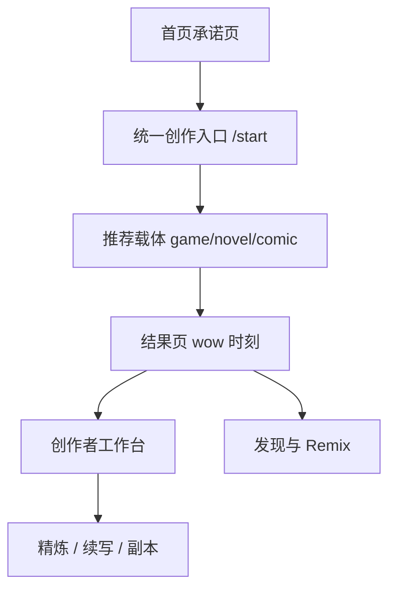

# 1ONE 产品重设计规格

**日期**：2026-06-08  
**北极星**：首次体验惊艳感（wow）  
**策略**：双层产品 — 惊艳入口 + 创作者工作台

---

## 1. 问题诊断

| 断点 | 现状 | 用户感受 |
|------|------|----------|
| 首页 | 能力目录式罗列游戏/小说/漫画 | 「功能很多，但不知道先点哪」 |
| 创作入口 | 三条链路平行分叉 | 「我该选游戏还是小说？」 |
| 结果页 | 技术操作区前置 | 「生成了，但成就感被按钮淹没」 |
| 工作室 | 作品列表 + 管理 | 「像仓库，不像下一步指引」 |
| 发现页 | 排序网格 | 「能逛，但不容易被转化去创作」 |

**结论**：技术闭环完整，产品叙事分散。优先收敛首屏承诺与主路径，深度能力下沉到第二层。

---

## 2. 双层产品结构

### 第一层：惊艳入口
- 首页只回答：是什么 / 能得到什么 / 先点哪里
- `/start` 统一承接「一句话创作」
- 结果页第一屏展示成果，操作第二屏

### 第二层：创作者工作台
- `/studio` 升级为「下一步该做什么」
- 发现页增加 Remix → 创作转化
- 后台治理（账号、审核、推荐位）作为 Phase 4

---

## 3. 信息架构变更（已落地）

| 页面 | 变更 |
|------|------|
| `/` | Hero 聚焦 wow；3 步流程；案例区；去除重复区块 |
| `/start` | 统一创作入口 + 智能推荐载体 |
| `/create` 等 | 支持 `?prefill=` 承接统一入口 |
| `/play/[id]` 等 | `ResultMomentBanner` 结果优先 |
| `/studio` | 创作者中心摘要条 + 无封面提醒 |
| `/discover` 等 | 发现页顶部创作转化条 |

---

## 4. 阶段路线图

### Phase 1 — 叙事与首页（本次）
- [x] 产品 IA 配置 `src/lib/product-ia.ts`
- [x] 首页重设计
- [x] 统一入口 `/start`
- [x] 导航主 CTA 对齐

### Phase 2 — 创作与结果（本次部分）
- [x] 结果页 `ResultMomentBanner`
- [x] novel/comic 创作页 prefill
- [ ] 生成中阶段文案统一（后续）

### Phase 3 — 工作室与发现（本次部分）
- [x] 工作室创作者中心条
- [x] 发现页转化入口
- [ ] 作品状态机（草稿/已发布）（后续）

### Phase 4 — 后台治理（规划）
- 正式账号体系替代 Cookie ownerKey
- 审核流与推荐位运营
- 删除资产 GC、限流、封面补生成治理
- 详见 [`2026-06-08-ops-governance-roadmap.md`](./2026-06-08-ops-governance-roadmap.md) 与 `src/lib/super-admin.ts` 临时方案 → 正式 RBAC

---

## 5. 成功指标（建议）

| 指标 | 说明 |
|------|------|
| 首访 → `/start` 点击率 | 首页主 CTA 转化 |
| `/start` → 任一创作页 | 统一入口有效率 |
| 首次生成完成率 | 进入结果页比例 |
| 结果页 → 工作室 / 分享 | wow 后深度转化 |

---

## 6. 相关文件

- 配置：[`src/lib/product-ia.ts`](../src/lib/product-ia.ts)
- 入口：[`src/app/start/page.tsx`](../src/app/start/page.tsx)
- 首页：[`src/app/page.tsx`](../src/app/page.tsx)
- 结果条：[`src/components/ResultMomentBanner.tsx`](../src/components/ResultMomentBanner.tsx)
- 可视化：[`canvases/1one-product-ia.canvas.tsx`](../../canvases/1one-product-ia.canvas.tsx)
